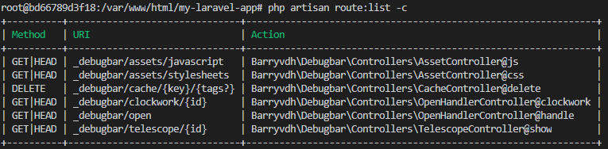

Laravel Debugbar は便利なんだけど、artisan route:list コマンドでルーティング情報をリストアップする時、先頭に「_debugbar」ノイズが入ってくるのが玉にキズ。  

##### （参考画像）  
  

何とか出来ないかと調べてみたものの、解決策が全然見つからなかったので issue 立ててみたが、まずは stackoverflowにでも投稿する内容だったんじゃないのか。これ・・・。  

立てた issue、こんな感じ。  
<https://github.com/barryvdh/laravel-debugbar/issues/1046>  

良く考えると、これは Laravel Debugbar が何とかする問題なのか？ artisan route:list コマンドの方で除外設定ができればそれで解決できない？  
と思って調べたが、特にそういうオプションは無い模様。  

そのついでに、このコマンドどうなってんの？　と思って artisan コマンドのソース見てみたが、さっぱり理解できねええええ！！！！！  

## 追記

こんなイベントがあった。

##### コードを読もうぜ！～Laravel編～
<https://nrs-seminar.connpass.com/event/179556/>

>下記はあくまで予定ですが、主に見ていく箇所です。
>
> - 全体的な通信の流れ
> - ルーティング
> - DI Container
> - ***コマンド類（artisan）***

見るしかない。
