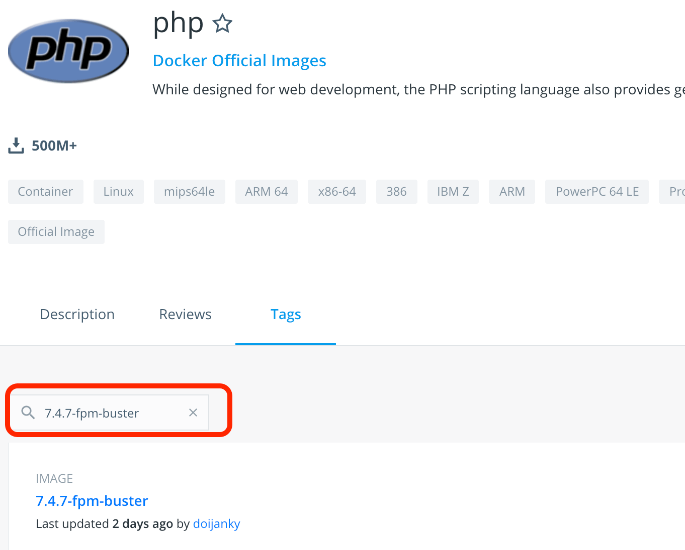
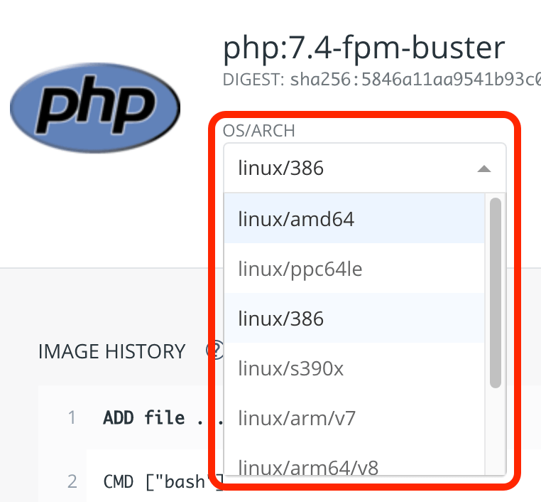

Dockerfile も docker-compose.yml も結構雰囲気で書いてたんで、ちゃんと勉強しなおしてみた。  

触っていくうちに湧いてきた疑問点のまとめと、自分なりの回答、一部は Twitterで回答が得られたものがあったので、メモとして残しておきます。  

## Q. docker-compose.yml ： depends_on って要るの？
depends\_on って、マニュアル読む限りだと使った方が良さそうな気がするんだけど、公式でも記述がないのがあるぞ。  
結局、depends_on は書かなくていいのだろうか。  

## A . 書かない方が稀だと思います。
<https://twitter.com/itmono_sakuraya/status/1271086237718212611>  

>書かない方が稀だと思いますね。例えばDBが起動する前にAppサーバー立ち上げるとコネクション貼れなくて起動に失敗したり、Appサーバーが起動する前にNginxが起動してリクエスト受け付けるようになるとまずかったり。コンテナ間の依存関係があるからこそdocker-compose使うものだという認識です。

・・・とのことでした。[青いエンジニア](https://twitter.com/itmono_sakuraya) さん、アドバイスありがとうございます。  
公式でも記述していない yml ファイルが普通に見つかるんで、書かない方がいい理由があったりするんかいな。と思いましたが、記述する事にします。

__________________________________________________________
## Q. Dockerイメージのベースディストリは、Alpine がいい感じなの？
これ。  
<https://alpinelinux.org/>  

軽量でいい感じらしい。  
Dockerイメージに使われているのを、ちょくちょく目にする。イメージファイルが軽量化できるみたい。  

とりあえず使ってみるかーと思って進めてみるも、Debian系でも Red Hat系でもないという点と、パッケージマネージャーが apkという得体の知れないもの（主観）を使っているという点で、手が止まった。  

つーか何だよ apk って。Android かよ。  
詰まった時のググラビリティの悪さが超不安だ。  

よく分からんディストリ使ったせいで変にハマるよりは、手に馴染んでる Debian系かRedHat系を使った方がいいんじゃねーかと自分の中で思い、採用は見送った。  

あと、調べたら、こんなのがあった。  

##### 超軽量なAlpine Linuxについて調べた
<https://qiita.com/ryuichi1208/items/6020cfabc92bd8153654>

>Alpineの特徴に軽量とありますがどれくらい軽量化というと下記比較を見れば一目瞭然
>
> - CentOS 約4GB
> - Ubuntu 約700MB
> - Alpine 約100MB

おお。凄い。  
というか、CentOS と Ubuntu って、こんなに差があったのか。  

でも、  

>ashというシェルが採用されています。  
>
>DockerのイメージにAlpineをつかう際に何も知らずにつかうとハマるらしい  

聞いた事もないシェル使ってるぞ。  
ちなみに自分は、  

「シェルを変えたりカスタマイズしたりする事により得られるメリット」　＜　「シェルをカスタマイズする事により、変なハマりポイントに遭遇するデメリット」  

と感じている人間なので、余計なカスタマイズは入れず、デフォルトのシェルをほとんど素に近い状態で使っている。  
シェルを弄ると、環境構築時に影響が出てくる事があるし、ただでさえもスムーズに行く方がびっくりする環境構築やデプロイ周りの作業に、更に余計な手間かけたくねーよ。という思いで。  
（※個人の感想です）  

まぁ、ハマる状況があるのは仕方ないにしても、ググってちゃんと情報が出てくるかはすっげえ不安だ。  
以前、Linuxのディストリを色々試した時、マイナーな物は不安定な動作をする物が多いうえ、行き詰まった時に情報が探しづらいので、やっぱり広く使われている物を選んだ方がいいな、という結論になったし。

その時書いたブログがこれ。  
[Linux：マイナーディストリをいくつか試した感想](https://www.kakistamp.com/entry/2017/06/05/013635)  

あと、こんなのも見つけた。  
##### 『お前のDockerイメージはまだ重い』
<https://speakerdeck.com/stormcat24/oqian-falsedockerimezihamadazhong-i>  

Alpine Linux について、こんな言及があった。  

>Alpine Linux  
> - Dockerfile作りが職人芸になりがち
> - パッケージのバージョンがそれほど新鮮でない
> - なので、最新パッケージはソース持ってきてコンパイル

やっぱり Alpine ベースは避けた方が良さそうな気がする。   

その他、スライドで気になった点。  

 - アプリのパフォーマンスや利便性の向上、および安定性の差について触れていない  
 - 軽量化にこだわる事によるデメリットや技術負債について触れていない  

いくら軽量化しても、上記の点で大きなデメリットや負債が発生するなら、別にそこまで躍起にならなくてよいのでは？　というのが素直な感想。  
そして、Alpine を採用する最大の理由が「軽量化」なら、技術負債を抱えてまで実施する必要性が見いだせるかどうかは疑問だ。  
コンテナを何百個も動かすような巨大なプロジェクトならまだしも、せいぜい１０個ぐらいまでしかアクティブにならないプロジェクトなら、普通にメジャーなディストリをベースにした方がよいのでは？　というのが個人的見解。  

あと、Docker公式の『Dockerfile 記述のベスト・プラクティス』にも、ベースのイメージについて言及があった。  
<http://docs.docker.jp/engine/userguide/eng-image/dockerfile_best-practices.html>  

>イメージのベースは、できるだけ現時点での公式リポジトリを利用してください。   
>Debian イメージ がお勧めです。 このイメージはしっかりと管理されていて、充実したディストリビューションであるにもかかわらず、  
>非常にコンパクトなものになっています（現在 150 MB 以下）。

公式が「Debian がお勧めだよ！」と言っているなら、それで満足できない理由が無い限り、推奨ディストリを使った方がいい気がするぞ！  

## A. 使わない方が無難じゃないかな
軽量化し、バリバリにチューニングしたい人以外は、メジャーなディストリをベースにした方が良さそうな気がします。  
「使わない方がいい理由」は沢山見つかったけど、「使った方がいい理由」は、今一つ弱いと感じました。  

__________________________________________________________
## Q. 公式配布のイメージがいっぱいあるけど、どれを使えばいいの？　あと、ディストリは何なの？
Docker Hub にて、PHPが公式に配布しているイメージがこちら。  
<https://hub.docker.com/_/php?tab=tags>  

公式配布のイメージひとつ取っても、  

 - php:cli-buster
 - php:zts-buster
 - php:7.4.7

等、様々なラインナップがあり、どれ選んでいいのかさっぱり分かんねーよ！  

あと、ディストリを明記してくれてないんで、yumを使えばいいのか apt使えばいいのか判別がつかん・・・

## A1. ディストリは明記されてるよ！
<https://twitter.com/moyashidaisuke/status/1271598998588030977>  

>「buster」がディストリビューションの名前ですよ。Debian10のことですね。（そんなのいちいち覚えてられないからDebian10と書いてくれれば良いのに・・・とは思います

・・・とのことでした。[福田大翼（ダイスケ）＠フリーランスのエンジニア](https://twitter.com/moyashidaisuke) さん、アドバイスありがとうございます。  

と言う事で、apt-get を使えばよさそうです。  
「buster」については、調べたらちゃんと出てきました。  
<https://packages.debian.org/stable/php/>  

Debian系で間違いないみたいです。  
composer や phpdebug といった、使用頻度が高そうな物は一通り揃ってそうなので、「とにかく、必要最小限だけの構成にしたい！」という人以外は、こっちを使うのが無難ではないでしょうか。  

本番環境には要らなさそうな物も結構入ってるのが気になりますが、そこを気にし始めると、本番環境と開発環境で Dockerイメージが異なる事になり、地獄みが深そうな事になる気がするので、スルーします。  

そういう運用ってあるのだろうか？　と思って調べてみたら、普通に実例があるみたいだ。  
[dockerで本番環境と開発環境を使い分ける方法いろいろ](https://crieit.net/posts/docker)  

あと、このリポジトリでは、「Dockerfile」と「Dockerfile.production」の２種類を用意している。  
<https://github.com/ucan-lab/docker-laravel>  

こんな感じのテクニカルな運用を考えるのは、もうちょい後にしておこう。  

## A2. PHPなら「php:7.4.7-fpm-buster」が無難じゃないかな。
PHP を使う場合「php:7.4.7-fpm-buster」が無難な気がします。（2020年 6月時点）  

理由としては、

 - 最初から色々入ってるんで、カスタマイズが必要となる部分が少なそう
 - Debian系（メジャーなディストリ）

という点。  

あと、latest（最新）のタグがついているイメージと、バージョンが明記されていないイメージは避けました。  
後で見た時に、バージョンが分かんなくなりそうなので。  

というか、latest って、再現性が悪いと言う点で、結構危険なのでは？  
別に問題にならないならいいんだけど、余計な不安は排除しておこう。  

ちなみに、Docker Hubにて配布元に到達したら、「Tags」タブにてピンポイントでの検索が可能です。  
  

__________________________________________________________
## Q. イメージ選択した時に出てくる「OS/ARCH」の選択項目って何？
この項目。  
  

Dockerって、使うCPUまで意識するの？  
そこまで意識して書いてる Dockerfile って、見た事ないぞ・・・。それとも、今まで見落としていただけか？  

あと、これ変えても pull する内容が変わってくる訳ではないみたい。  

選択する内容を変えると、右の「Command」項目の、  
「 ADD file:9fxxxx in / 」  
の部分が変わるけど、これをどうすればよいのだ。  
Dockerfileに書くの？  

## A. 実はプラットフォームを合わせる必要があるよ！

<https://twitter.com/localyouser/status/1271666245767622657>  
>Dockerは実際にはベースのOSにおいてプロセスとして動くから、プラットフォームは合わせなきゃならんのよね

おお・・・。そうなんですね。  
勉強になります。  
使い方は今一つ分かっておりませんが。  

>ハイパーバイザはハードから仮想化しますが、それでもCPUのアーキテクチャからは逃れられませんぬ。
>Dockerはカーネルを流用する動きをしますのよ

勉強になります。。。  
そういや、Dockerはプロセスとして動いているんだった。  
んで、プロセスとして動く以上、CPUのアーキテクチャの影響下にあると事か。  

>例えばラズパイとかはArmだしね。

なるほど。  
その場合って、Dockerfileに  
「ADD file:9fb8fd8bf970c4134f555964fe485a3baa84f1d4c91c5aa35276c24404de9d5d in / 」  
とか書いたりするんですか？  

>組み方次第なんだと思います。
>多分。

了解す！  
精進します。  

>うす〜。
>多分必要なディレクトリなりをハッシュ化された名前に置き換えてる気がしました。
>多分ツールとかの造りに左右されるのかな、なんて。

[ろーかるゆーざー＠人生コツコツ](https://twitter.com/localyouser)さん、ありがとうございます。  
時々絡んでくれて、非常に深い知見を惜しみなく出して頂き、いつもありがとうございます。  

__________________________________________________________

ここまで来て、ようやくベースのイメージの選定が完了し、ようやく Dockerfile を書き始めると言う段階です。  
「こんなアプリ作ろーっと。んで、これを期に Dockerfile と docker-compose.yml を整備しとくか。」と思い、ちゃんと理解を深めていこうとしていったら、こんな事になった。  

続きはまた後日。  

