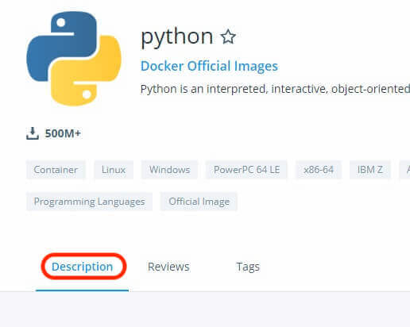
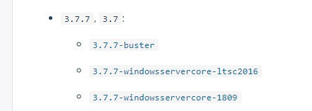

[先日](./2020-06-13) の続き。  

Docker のベースイメージのディストリが何なのかを知るまで、えらい時間がかかった話。  

Docker Hub にて配布されているイメージ名が「7.4.7-fpm-buster」ってなってたら、「buster」の部分が Debian のコードネームなので Debian ベースか。と判別できた。  
でも、「python:3.7.7」や「golang:1.13.12」といった、コードネームすら書かれていないイメージは、どうやって判断しとんじゃい。  

というか、Dockerfile を書く時に、「ベースイメージのパッケージマネージャーは何？」というのは、絶対に初期にブチ当たる疑問のはずなのに（ディストリを知らないと yum を使うのか apt-get を使うのか判断がつかない）、なんで誰が見ても一目瞭然な構成になってないんだ？？  
複数選択肢があるなら、Debianベースを選択したいと考えているだけなのに。  

##### 参考：python:3.7.7
<https://hub.docker.com/_/python?tab=tags&page=1&name=3.7>  

##### 参考：golang:1.13.12
<https://hub.docker.com/_/golang?tab=tags&page=1&name=1.13.12>  

・・・という内容を Twitter に書いたら、[福田大翼（ダイスケ）＠フリーランスのエンジニア](https://twitter.com/moyashidaisuke)さんからレスポンスを頂きました。  
先日に引き続き、ありがとうございます。  

## A. Description から探せる
イメージを探すときは「Tags」タブを使うけど、説明見る時は「Description」タブ。  

  

「python:3.7.7」の場合、こんな感じの記述がある。   

  

クリックしたらイメージファイルが確認できる。  

ただし、ここでも「buster」といった Debian のコードネームを知らないと識別できないという不便な点は残ったままだ。  

##### 参考：Debianのコードネーム
<https://debian.org/releases/>  

トイストーリーのキャラクター名が由来らしい。  
み・・観てないから全然分からねぇ・・・。  

Android みたいに、「ABCD... の順になっていて、お菓子の名前」といった法則があれば新古が判断つきやすいのに。  
（廃止になったけど。）  

__________________________________________________________________________________________________________
# ＜その他、色々試してみた点＞

## docker inspect コマンドを使う
「"OS" : Linux」といった情報は得られるが、ディストリ情報までは取得できず。  

## イメージファイルの中身を解析できるツールを使う
undocker というツールがありました。  
<https://github.com/tokibi/undocker>  

が、これでもディストリ情報は取得できず。  

というか、pull する前に知りたいんだよな。  
ローカルに持ってきたものを解析して、要る/要らないの判別するとか超面倒。

## 同じような疑問にブチ当たっている人は居ないの？
同じような疑問にブチ当たっている質問を見つけた。  

##### docker pullしたImageのディストリビューションを知りたい。
<https://teratail.com/questions/177321>  

> Q. Docker Hubのサイト内からOSの種類を確認する方法はありますか。

まさに自分が遭遇している問題、そのもの。  

> A. Docker Hubのサイトでは、大半のイメージではDockerfileが公開されています。

どこじゃーい！　と見つけるのに苦労しました。というか、アドバイスをもらうまで見つけきれませんでした。  
何で pull する内容のすぐ近くに書いてくれてないんだ・・・。   

あと、

> このDockerfileの先頭あたりに、だいたい利用しているOSイメージが書いてあるので、そのOSイメージの名前でOSやバージョン番号などがわかります。

ってあるけど、ここでも各種ディストリのコードネームを知らないといけないのよな・・・。  
やっぱり不便。  

## その他の調査方法
それでも分からなかった場合、  
「とりあえず pull してコンテナにログインし、yum もしくは apt-get を打ってみる」  
というのが近道な気がする。  

自分がディストリ確認する時って、Debian系なら「cat /etc/issue」を使って、Red Hat系なら「cat /etc/redhat-release」を使ってるんだけど、イメージファイルにはそもそも cat や vi が入ってない事もあるんで、そうなると cat をインストールするためにパッケージマネージャーに何を使っているのかを知る必要が（  
と余計なループが発生。

なので、「ディストリは知らんけど、とりあえずコマンド打っとけ」というアプローチが正解な気がする。  
正直、パッケージマネージャに何を使っているのか分かりさえすれば、ディストリは必要な時に後で調べりゃいいし。  

