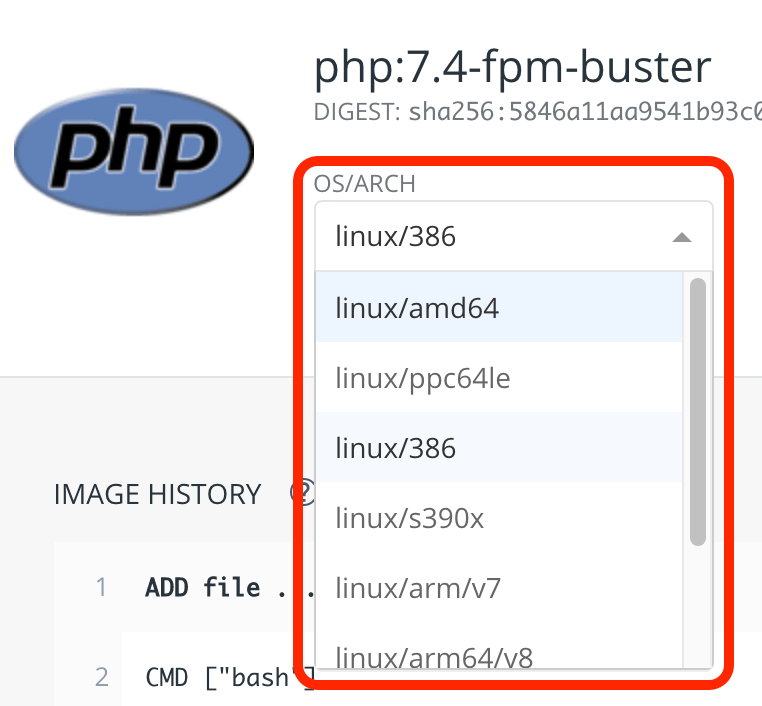

Docker hub にて、イメージを洗濯した時に出てくる「OS/ARCH」の選択項目の意味がよく分からなかったので調べてみた。  

この項目。  
  

[先日](./2020-06-13) も書いたけど、もう少し掘り下げ、というか実践編。  
何やらマトモな記事になりそうなので、Qiitaにでも投稿しておくか・・・という事を意識して書き始めたが、予想外の結果になったため、方向性を変更！  

つまり没案だな！  
でも一応、残しておくぜ！  

以下、投稿予定だった記事↓  
____________________________________________________________
____________________________________________________________
____________________________________________________________
____________________________________________________________
____________________________________________________________

Docker hub のイメージ選択時に出てくる「OS/ARCH」って何？　詳しく調べてみた。

Docker hub のイメージを洗濯した時に出てくる、この項目。
  

Dockerって、使うCPUまで意識するの？  
そこまで意識して書いてる Dockerfile って、見た事ないぞ・・・。  
と、気になったので調べてみました。というか、一部は詳しい方が教えてくれました。  

 - Docker は、実際にはベースのOSにおいてプロセスとして動くので、プラットフォームは合わせなければいけない。
 - ハイパーバイザはハードから仮想化するが、それでもCPUのアーキテクチャからは逃れられない。
 - Dockerはカーネルを流用する動きをする。
 - 例えばラズパイとかは Arm だぜ。

という事みたいです。
「Dockerはプロセス単位で動く」という事を、教科書的な意味では知っていても、実際に動かすときはCPUまで意識する事は、ほとんど無かったので、何やら新鮮。

簡単に言えば、
『Docker使用時にはプラットフォームを合わせなければいけないので、何らかの事情があって異なるプラットフォームのイメージを pull したいという状況にも対応できるようにしています。』
という事だと思います。

Docker のマニュアルにて、DIGESTを指定して pull できるという記述がありました。  
<https://docs.docker.com/engine/reference/commandline/pull/>  
```
docker pull [OPTIONS] NAME[:TAG|@DIGEST]
```
@DIGEST は、この部分。  
  

「OS/ARCH」の選択内容を変えると、「DIGEST」の値が変わります。  

ちなみに、アーキテクチャの確認コマンドは、以下。  
```
arch
```
「i386」とか「i486」といった値が出てきます。  
____________________________________________________________
____________________________________________________________
____________________________________________________________
____________________________________________________________
____________________________________________________________

↑投稿予定の内容、ここまで。  

・・・と、ここまで来て、てっきり本体のアーキテクチャと異なる場合は、違う結果になると思いきや、普通に起動できちゃったよ！  
何で？　と思って調べたら、「ああ。こういう事かー。」と考えつく所があったので、今度はちゃんとしたエントリにして書く！  

ちなみに DIGEST を指定して pull する場合、「@」が必要だし、sha255～あたりの記述からかき始めないといけないぞ！  
具体的にはこんな感じ。  
```
docker pull php@sha256:84311597ecddef820dfab8893acbcdc1f1b3b545decfedf791aa7b99429206df
```
あと、docker pull したにもかかわらず、docker images に出てこなかった。何でやねん。  
仕方ないんで、docker-compose で動かした。  

#### 追記
ちゃんとした内容にして Qiitaに書いた。  

[Docker hub からイメージを pull する時、CPUのアーキテクチャを指定する。](https://qiita.com/kakisoft/items/dccff592ff7bfeb5bc48)
