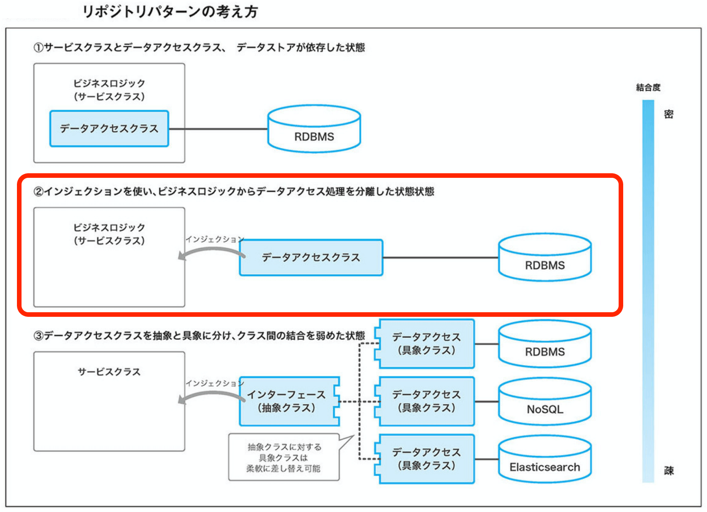

ゼロイチの開発で、Laravel 使うことになったプロダクトのソースが CHAOS-☆ な感じだったので、何とかしよう。  
と思って、アーキテクチャを真剣に考えてみた。  

その経緯や思想とか。  

なお、完成版ではなく、以降も試行錯誤して改善していく予定なのであしからず。  
（ちょこちょこ更新しています）  

#### 環境
PHP 7.4.11   
Laravel Framework 8.15.0  


## Laravel の特徴（主観）
フレームワークとしての枠組はありながらも、その枠組みは比較的緩く、開発初期にアーキテクチャを決めておかないと、あっという間にやゔぇぇえ事になってしまう。  

が、「こういうアーキテクチャにしてみようかな」と思ったら、必要なパーツは既に揃ってたり、比較的簡単に実現できたりする。  
「ガチガチの枠組みは用意しないが、どんなアーキテクチャを考えたとしても、それを構築できるようにしてあるぜ！」  
という思想なのだろうか。  

その辺りは、今度調べておくか。  


## 参考資料

### 参考文献
PHPフレームワーク Laravel Webアプリケーション開発
<https://www.amazon.co.jp/dp/B07SPT6XJV/ref=dp-kindle-redirect?_encoding=UTF8&btkr=1>   

### 参考にしたOSS
Koel  
<https://github.com/koel/koel>  

Laracom  
<https://github.com/jsdecena/laracom>  

他は省略。  

### webサイト
何か色々。  


## 現状の問題点
Controller から Model を直接参照していたり、Controller に凄まじい量のビジネスロジックが記載されていたり、ユーティリティやトレイトが一切定義されていなかったり。  

という事で、  
「どこに何を書くか」  
というルールを決めておこう。  

まずはリポジトリ層を用意して、モデルを直接操作しないようにしよう。  


## リポジトリパターンの構成
リポジトリパターンの種別。  
（参考文献：PHPフレームワーク Laravel Webアプリケーション開発）  

  

 1. サービスクラスとデータアクセスクラス、データストアが依存した状態
 2. インジェクションを使い、ビジネスロジックからデータアクセス処理を分離した状態
 3. データアクセスクラスを抽象と具象に分け、クラス間の結合を弱めた状態

色々と悩んだ結果、今回「２」の結合度で行くことにした。  
理由は後述。  


## 層
以下の階層を用意

 * Controllers
 * Services
 * Repositories
 * Models


### Controllers
ビジネスロジックをここに書かない。  
Model に直接アタッチするのは禁止。  
基本、Service を触る。  

ただし、単純にレコードを引っ張ってきて、それを返す、という処理なら、Repository を触っても良いとする。  
・・・と言った感じで、処理が極めてシンプルになる場合は例外的に認めちゃっていいかな、と思ったけど止め解きました。  

「どんな時に例外を認めて、どんな時に認めないか」というのを開発者個人の判断に任せると、中にはとんでもない粒度で書く人が出てくる可能性があるし、それをルール化するのも面倒だったので。

いっそ例外を認めず、「Model の直接捜査は禁止！Service を触れ」と定義したほうが良さそうな気がしたので。今回はそうしました。  
結果的には、こっちでよかったんじゃないかと思っています。  

### Services
ビジネスロジックは、ここに書く。というかここで完結させろ。  
主にコントローラからコールされる。  
他にも、バッチからコールされる事もある？　その辺は特に制限を設けないようにしておこう。  
DBを触る時は、Repository　を経由。  

（追記：プロジェクトを進めていくうち、ジョブやコマンドからもコールするようになりました。コールされる場所の制限は設けなくてよさそうです。）  

また、Service から Service をコールする行為は、本当にそれ以外の方法がないのか、じっくり考えた上で行う事を原則とする。  

経験上、サービスからサービスをコールすると、機能追加や修正をする時、気を回さないといけない部分が複雑に絡み合い、やゔぇ事になりやすい。  
多くの場合、複数のサービスをコールする必要がある時、例えばジョブから、「サービス１をコール」「サービス２をコール」と言った感じの処理に落とし込めるんじゃないかと思っています。  
まずはその方向でロジックを考える事ように呼びかけてみよう！

### Repositories
モデルを操作する時に使用する。  
モデルとの疎結を疎にするために必要。  
基本、モデルと１対１になるんじゃないかと思う。  
そのルールから外れるケースって、どんな時だろ・・・？　まぁいいや。そんな状況に遭遇した時に考えよう。  

調べてたら、こんなのを見つけました。  
[やはりお前たちのRepositoryは間違っている](https://qiita.com/mikesorae/items/ff8192fb9cf106262dbf)  
「リポジトリは、モデルと１対１とは限らない」という内容。  

まぁ納得なんだけど、「操作するモデルが、リポジトリとかけ離れている」というのも問題な気がするんだよ。  
例えば、「車輪を操作したい」と思った時に、そのメソッドが Car クラスに存在する、といった場合「このモデルを操作しているリポジトリはどれ？」と、仕様を理解していないと読み解きづらいソースになっちゃうし。  
（フレームワークを採用している以上、詳細仕様が頭になくとも、機械的にソースを読めば何とかなってしまう状態に落とし込めるのがいい構造だと思ってます）  

あと、「車輪を操作する」という処理を Car 経由でやらなければいけない時、「車輪を操作するメソッドはどこに書くの？」という事を考えると、「Car クラスに車輪Model を操作するメソッドを記述する」というのは、いささか不自然な気がする。  

この場合、「車輪モデルに定義されたメソッドを、Carクラスからコールする」という構造が自然だと思うのだが、どうだろう。  
（Model の直接捜査は原則禁止にしているので、必然的に Repository も作成される）  

あと、例外を認めてしまうと、「どんな時に例外を認めて、どんな時は認めないか」というのをルール化するのは、結構大変なので、個人的にはあんまり積極的に採用
しない派です。  

ちなみに今回のプロジェクトでは、「モデルとリポジトリは１対１」、というルールを採用しました。  
特にソースがカオス化する事なく、上手い事行ってます。  


### Models
ビジネスロジックに依存しない、単純なデータIO は、ここに記述。  

その他は、特記事項なし。  
一応、「hasMany とか blongTo とか、そういったリレーション情報はちゃんと書け」っては明文化しとくか。  


## 実際に書いたコード
全体としては、こんな感じ。  
<https://github.com/kakisoft/PracticeLaravel8-01>  

説明が必要な部分飲みを抜粋。（コードの中身は色々と省略しています。）  


### コントローラ
Service をインジェクション。  
```php
// app/Http/Controllers/AlbumController.php
class AlbumController extends Controller
{
    private $albumService;

    public function __construct(
        AlbumService $albumService
    ) {
        $this->albumService = $albumService;
    }

    public function addmylist(AlbumRequest $request) {

        $this->albumService->executeSomething( intval($request->album_id) );

        return response($request->album_id, Response::HTTP_OK);
    }

}
```

### サービス
Repository をインジェクション。  
```php
// app/Services/AlbumService.php
class AlbumService
{
    private $albumRepository;

    public function __construct(AlbumRepository $albumRepository)
    {
        $this->albumRepository = $albumRepository;
    }

    public function executeSomething(int $artist_id): array
    {
        $this->albumRepository->addMyAlbum($artist_id);

        return array();
    }
}
```

### リポジトリ
全てのリポジトリは、AbstractRepository を継承するものとする。  
```php
// app/Repositories/AlbumRepository.php
class AlbumRepository extends AbstractRepository
{
    public function getModelClass(): string
    {
        return Album::class;
    }

    public function getMyAlbum(int $id): array
    {
        // サンプルで書いた、特に意味のない処理だよ
        return $this->model->find($id)->toArray();
    }
}
```

### リポジトリの親
詳細は後述。  
```php
// app/Repositories/AbstractRepository.php
abstract class AbstractRepository implements RepositoryInterface
{
    protected $model;

    abstract public function getModelClass(): string;

    public function __construct($targetObject = null)
    {
        if( is_null($targetObject) ){
            $this->model = app($this->getModelClass());

        }else{
            $this->model = $targetObject;
        }
    }
}
```

## 思想

 * Repository と　Model は、１対１
 * Repository のインスタンス生成時、対応する Model を内部（$this->model）に保持
 * モデルを操作する時は、各々のクラスに配置された $this->model を使用する。

こうする事で、以下を実現できる。

 * Model との疎結合を実現
 * テスト時に　Mockと差し替えやすくする（テスト時は、テスト用のモックオブジェクトをコンストラクタの引数として渡す）

本当は、
```php
public function __construct($targetObject)
{
```
といったコンストラクタを用意したかったけど、PHPにはオーバーロードが無かったYO！


## 思想の根っこ
結合度を少し落としたのもあって、今回、Model の分離に interface を使用していません。  

理由としては、  
「疎結合にして部品を交換しやすくする」  
という考えは当然重要だが、  
「そうする事で、ファイルが増え、コードも冗長化するというデメリットがある」  
という事もセットで考えるべきだし、  
「部品を交換する可能性がどの程度あるか」  
という事も併せて考えておくべきだと思っているからです。  

インターフェースを使うと、それだけで一気にファイルとコードが増えるので、「インターフェースを使わずに疎結合が実現できるなら、そっちの方向で検討してもよいのでは？」と思っています。  

DDD で開発するならインターフェースは絶対に必要だと思いますが、今回、開発手法に DDD を採用しているわけではないので、そうしました。  

「部品を交換する可能性がどの程度あるか」を真剣に考えるのも、かなり重要な事じゃないかと思っています。  
（感覚的には、あまり議論されず「付け替えは容易にできるべき！疎結合最高！（デメリットには目を瞑って）」となっているケースも多いんじゃないかという気がします。）  

まず、上記の図をもう一度。  
  

「３．データアクセスクラスを抽象と具象に分ける」というパターンを紹介しているが、これらを差し替えるケースが一体どれほどあるというのだろうか。  

というか NoSQL は RDB の代替にはなり得えるのだろうか。（技術的には可能だけど、機能として要件を満たすの？　という意味で）  
Elasticsearch は良くわからないけど、RDBの代替として機能するかどうかは疑問だ。  

「いや、それらはそもそも RDBと考え方が根幹から違うから、同列に考えちゃダメだよ。」  
という意見が聞こえてきそうだけど、図では交換可能な部品の候補として、モロに同列に扱われているし。  

RDB から NoSQL に差し替える時って、RDB の考え方をそのまま適用すると痛い目に遭うケースがあって、データの持たせ方を変えたり、あえて正規化しなかったりとか、と言う話をちょくちょく聞く。  

正規化する/しない という話になってくると、「データの持たせ方をどうするか」という所に話がおよび、「そこまで来たら Laravel のアーキテクチャで解決する話じゃなくね？」という考えてしまう。  

「差し替えを容易にする」  
というのは重要だけど、  
「本当に差し替える場面があるの？」  
というのは、じっくり検討する意味はあると思う。  

少なくとも自分は RDB の代替えになる技術が、そう簡単に出てくるとは思えん。  
来るかどうかも分からない「差し替えの時」に備えるためにコードを冗長化させるより、必要最小限の機能の分離ができていればよいのでは？  
というのが正直な意見。

というか経験上、疎結合を進めた結果、その恩恵を最大限に受けているプロジェクトよりも、プロジェクトには不相応な程に抽象化されてコード記述量が増え  
「面倒臭え！つーか、このプロジェクトで、ここまで抽象度高める意味あんのか？」  
ってなってるプロジェクトの方が多いんじゃないかと思う。  

「じゃ、結合度の緩め方をどの程度にするよ？」  
という話だけど、個人的には以下の２点が実現できていれば、それでOKなんじゃないかと思っている。

 * Model との疎結合が実現できている事
 * モックやスタブと差し替えやすい事

テスト時は、コンストラクタの引数にモックオブジェクトを渡す、という程度の手間は、十分目を瞑ってもらえる範疇だろう。  

「テストは書きやすいけど、プロダクトコードが冗長になる構成」と「テストは少し書きづらくなるけど、プロダクトコードが書きやすい構成」は、後者が採用されるべきだと思ってる。  

これがデータアクセスでなく、認証とかだと話は変わってくるのかもしれない。  
OAuth 使うとか Cognito 使うとか、独自の認証を使うとか。  
けど、それだともうデータアクセスとは全く関係ない世界になってくるので、それらの問題は個別に切り離して考えた方がよくね？  
というのが現時点での意見。  

・・・でも、コントローラにて Service をインジェクションしているトコは、ServiceInterface をインジェクションしても良かったかもしれない。  

まぁ、問題が出てきた時に対処しよう。  

　結合度：高い　→　結合度：中程度  

の変更は、なかなか苦痛だが、  

　結合度：中程度　→　結合度：高い  

の変更はごく普通だし、必要な部分をピンポイントで切り出す事も容易だ。  


## その他のルール

 * リクエストのルールやバリデーションは、コントローラに記述せず、RequestModel を使用する
 * どこからでも使う static な処理は、app/Facades/ に記述
 * 継承関係のないクラスに共通メソッドを持たせたい場合（トレイト）、 app/Traits/ に記述

上記のオープンソースの考え方をパクりました。  

・・・としようと思ったけど、ユーティリティは Facades でなく Utils でよかった気がする。  

具体的には、こんな感じ。  
```
└─app
   └─Utils
       ├─DateUtil.php
       └─RequestExtention.php
```

ちなみに「Facades」という単語を使ったのは、参考にしたOSS（koel）がそうなってた、ってのもあるけど、Laravvel 用語において「Facade」という単語が、「どこからでも参照できる、スタティックな処理」という意味で使われているように読めたから。  

それについては、こんなの書いた。  
[Laravel の「ファサード」と、デザインパターンの「ファサード」は、単語が同じなだけで全然別のもの？](https://kaki-note-02.netlify.app/2020/11/01/)  

Laravel、よくわかんねっす。  


## テストフォルダの構成
とりあえず、雑に書いた。  
[Laravel を使ったオープンソースの test ディレクトリ構成を見てみよう！](../21)   

必要になったら、ちゃんと書く。  

## おわりに
プロジェクトが進むにつれ、上記の考えに色々と問題が出てきて、少しずつ変更していく可能性は十分あると思います。  
というかなるだろ絶対。  

まぁ、アーキテクチャに絶対的な正解は無いと思うんで、これからも実験と失敗を繰り返しながら模索して行きます。


（→続編）  
[物流エンジニアが本気出して考えた Laravel のアーキテクチャ：リポジトリパターン - 2](../25)   
の続き。  