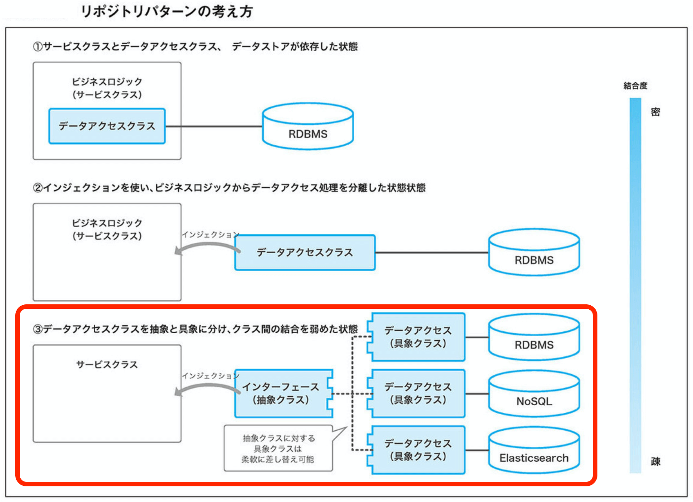

前回  
[物流エンジニアが本気出して考えた Laravel のアーキテクチャ：リポジトリパターン - 1](../22)   
の続き。  

Laravel のアーキテクチャというか、リポジトリパターンに絞って色々考えた話。  


## リポジトリパターンの構成
リポジトリパターンの種別。  
（参考文献：PHPフレームワーク Laravel Webアプリケーション開発）  

  

 1. サービスクラスとデータアクセスクラス、データストアが依存した状態
 2. インジェクションを使い、ビジネスロジックからデータアクセス処理を分離した状態
 3. データアクセスクラスを抽象と具象に分け、クラス間の結合を弱めた状態

今度は「３」のパターンで考えてみる。  


## オープンソースを参考にしてみよう
インターフェースをどこに配置しとんじゃい。  
という事で、世のオープンソースを参考にしてみる。  


### laracom
<https://github.com/jsdecena/laracom>  

```
 └─app
    ├─Http
    │  ├─Controllers
    │  │  ├─Admin
    │  │  │  ├─Addresses
    │  │  │  ├─Attributes
    │  │  │  ├─Brands
    │  │  ├─Auth
    │  │  └─Front
    │  │      ├─Addresses
    │  │      └─Payments
    ├─Providers
    └─Shop
        ├─Addresses
        │  ├─Exceptions
        │  ├─Repositories
        │  │  └─Interfaces
        │  ├─Requests
        │  └─Transformations
        ├─Categories
        │  ├─Exceptions
        │  └─Repositories
        │      └─Interfaces
        ├─Cities
        │  ├─Exceptions
        │  ├─Repositories
        │  │  └─Interfaces
        │  └─Requests
```

Models 階層が無い。  
そして、Models に相当する階層から、Repositories の階層、その下に Interfaces の階層。  
Request もここに放り込んでる。  

独自色が強め。  
あと、基底クラスに外部ライブラリを使っているケースがちらほら。  
Laratrust とか。  
<https://laratrust.santigarcor.me/>  
これも。  
<https://github.com/jsdecena/baserepo>

サービスに対するインターフェースは実装しているが、  
モデルに対するインターフェースは実装していない。  

そのまま参考にするのは、少しキツいか。  
特に、フォルダ構成はあんまり参考にしない方がいい。  


### koel
<https://github.com/koel/koel>  
Model との接続にインターフェースを使用していない。  


### MONICA
<https://github.com/monicahq/monicaa>  
Controller から直接 Model をコールしている


### LavaLite
<https://github.com/LavaLite/cms>  
Model を使用していない


### vuedo
https://github.com/Vuedo/vuedo  
Controller から直接 Model をコールしている


### October CMS
<https://github.com/octobercms/october>  
かなりクセが強い。途中「これ本当にLaravelか？」と思ったほど。  
あまり参考にしない方がよさそう。  


### Element In Laravel
<https://github.com/ElementUI/element-in-laravel-starter>  
Model を使用していない。  


### AIRFLIX
<https://github.com/wells/airflix>	
Model を使用していない  

・・・そんな感じで、オープンソースはあんまりアテにできませんでした。  
という事で、自前で何とかしてみます。  

## 参考文献

### 書籍
[PHPフレームワーク Laravel Webアプリケーション開発](https://www.amazon.co.jp/dp/B07SPT6XJV/ref=dp-kindle-redirect?_encoding=UTF8&btkr=1)   
さらっと書いているので、それほど参考にならなかったり。  

### 参考サイト
[https://qiita.com/bmf_san/items/c8d7b38b5f1f5747c2fd](Laravel リポジトリパターンの実装)  
[https://qiita.com/karayok/items/d7740ab2bd0adbab2e06](リポジトリパターンと Laravel アプリケーションでのディレクトリ構造)  


## 書いたコード
こんな感じ。前回のと混ざってるけど、気にしない。  
<https://github.com/kakisoft/PracticeLaravel8-01>  

説明が必要な部分飲みを抜粋していて、コードの中身は色々と省略しています。  

### コントローラ
Service をインジェクション。（前回のアーキテクチャと同じ）  
```php
class SongController extends Controller
{
    private $songService;

    public function __construct(
        SongService $songService
    ) {
        $this->songService = $songService;
    }
}
```

### サービス
Repository ではなく、RepositoryInterface をインジェクション。（前回から変わったとこ）  
```php
class SongService
{
    private $songRepository;

    public function __construct(SongRepositoryInterface $songRepository)
    {
        $this->songRepository = $songRepository;
    }

    // 色々と省略
}
```

### リポジトリインターフェース
当然、インターフェースを定義する必要がある（前回から変わったとこ）
```php
interface SongRepositoryInterface
{
    public function save(int $id, array $params);

    public function delete(int $id);

    public function getLatestRecords();

    public function getMySong(int $id);
}
```

### リポジトリ
リポジトリインターフェースを実装している以外は、前回と同じ。
```php
class SongRepository extends AbstractRepository implements SongRepositoryInterface
{
    // 色々と省略
}
```

### サービスプロバイダ
前回から変わったとこ。  
リポジトリインターフェースとのバインド設定を追加する。  
肥大化する事が予想される（リポジトリが増えれば、その数だけ行数が増える）ため、既存のプロバイダに追記するのではなく、新たに「RepositoryServiceProvider」というファイルを作成する。
```php
class RepositoryServiceProvider extends ServiceProvider
{
    public function register()
    {
        // Song
        $this->app->bind(
            \App\Repositories\Interfaces\SongRepositoryInterface::class,
            \App\Repositories\SongRepository::class
        );
    }
}
```

### プロバイダ設定
前回から変わったとこ。  
app.php にて、今回追加した RepositoryServiceProvider を追記。  
```php
    'providers' => [

        /*
         * Application Service Providers...
         */
        App\Providers\AppServiceProvider::class,
        App\Providers\AuthServiceProvider::class,
        // App\Providers\BroadcastServiceProvider::class,
        App\Providers\EventServiceProvider::class,
        App\Providers\RouteServiceProvider::class,
        App\Providers\RepositoryServiceProvider::class,

    ],
```

### リポジトリフォルダの構成
```
 └─Repositories
    ├─Interfaces
    │  ├─UserRepositoryInterface.php
    │  ├─ArticleRepositoryInterface.php
    │  └─CustomerRepositoryInterface.php
    │
    ├─Dummies
    │  ├─DummyUserRepository.php
    │  ├─DummyArticleRepository.php
    │  └─DummyCustomerRepository.php
    │
    ├─UserRepository.php
    ├─ArticleRepository.php
    ├─CustomerRepository.php
```
Dummies じゃなくて、Mocks の方がよかったかも。  
モデル名のフォルダを置いて、その下にリポジトリとインターフェースとモックを配置する、という構成もあるみたいだけど、リポジトリを俯瞰したいときに見通しが悪くなりそうなのでやめといた。  


## メリット
結合度をさらに下げた事により、差し替えがさらに容易に。  
インターフェースによるチェック機能が働く。   


## デメリット
コードを書く量が増える。具体的には、

 * リポジトリインターフェース（メソッド追加・修正時には、両方に修正が必要）
 * サービスプロバイダ（リポジトリを追加するたびに、バインド設定も追加）

IDE の恩恵を受けづらくなる。  
メソッドジャンプをすると、対象のメソッドではなく、インターフェースに飛ぶ。


## 所感
デメリットを見ると、「何だ。たいした欠点は無いじゃん。」と思われるかもしれないが、IDEの恩恵が受けづらくなるというのは、思いの外、大きい。  

最近は IDE の進化は凄まじく、もはや IDE の恩恵無しに開発は考えられないほどだ。（当方、VSCode も IDE と見なしてます。もうこれテキストエディタの範疇じゃない）  

IDE の恩恵を受けづらくなると、それはモロに作業効率の悪さに繋がるだけではなく、余計なストレスを抱え込み、さらに効率を悪化させる。  

そもそもエンジニアなんて、タイプ１つ分でも減らして効率化できるように、エイリアスやシェルをゴリゴリに設定するような連中だぞ？  
「コードジャンプ機能封印」という超嫌な縛りプレイをさせられて、不満に思わない人間がいるのだろうか。いや、いない。  

それだけではなく、インターフェースを定義すると、メソッド名の修正や引数の追加・修正が会ったとき、いちいち２つファイルを編集しなければならなくなる。  
仕様がふわふわで、技術的に要検証な部分も多く、トライアンドエラーを繰り返していく必要があるプロジェクトの場合だと、非常に苦痛だ。  

「コーディングがしづらくなる」という欠点は、深刻に受け止めるべきで、コーディグ効率を悪化させてまで受けるメリットがあるかは、十分に検討する必要があると思う。  

「やった！　あーきてくちゃ　を　しんか　させたぞ！」  
と、アーキテクチャを進化させた事を絶対正義としてお花畑みたいな発言をするのではなく、**アーキテクチャを進化させる事によって教授できるメリットが、アーキテクチャを進化させる事によって発生するデメリットを上回っているか**というのは、真剣に考えるべきだ。  

そして、多くの場合、過度に疎結合を進める事による進化は、メリットよりもデメリットの方が上回っていると思う。  
（詳しくは前回書いたんで、そこは割愛）  


