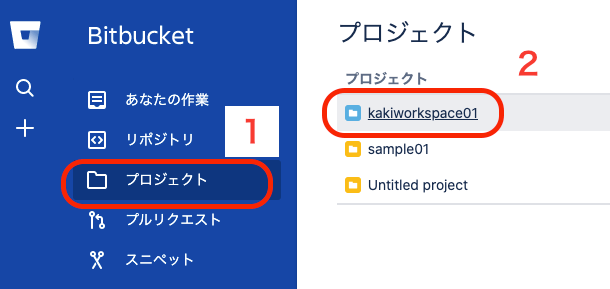
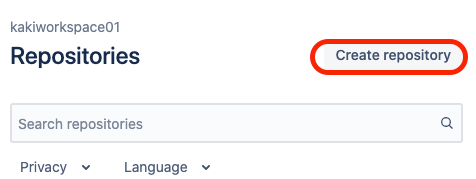
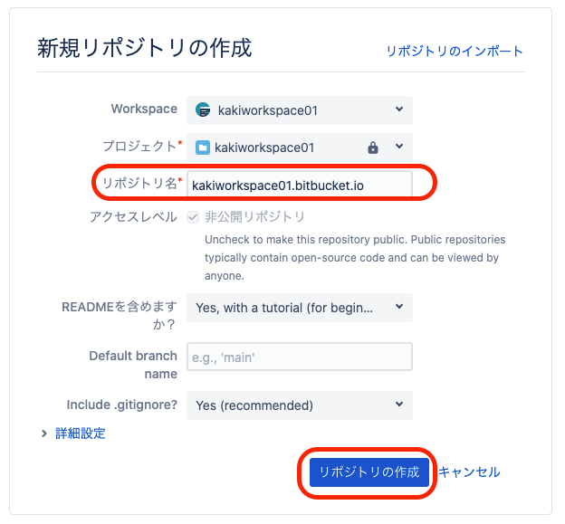
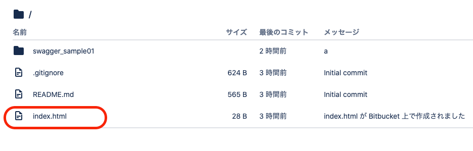
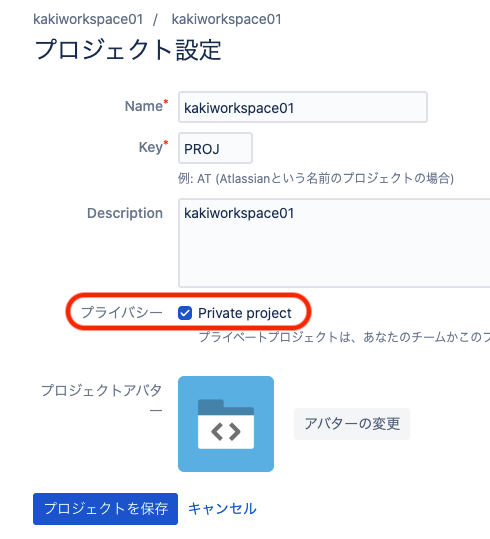
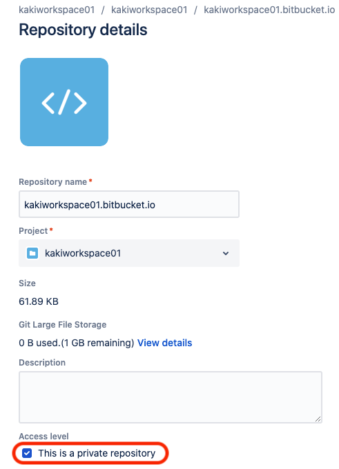

bitbucket にも、github pages みたいに静的ページを公開する機能があったんで、使ってみた。  

作ったのは、こんな感じ。（Swagger サンプル。yaml から html ファイルを生成したもの。）  
<https://kakiworkspace01.bitbucket.io/swagger/swagger_sample01_bootprint/index.html>  

以下、参考にした公式ページ。  
<https://support.atlassian.com/bitbucket-cloud/docs/publishing-a-website-on-bitbucket-cloud/>  

#### 戸惑った点

 * リポジトリ単位ではなく、ワークスペース単位での公開となる
 * 静的ページを公開するリポジトリは、「ワークスペース名/bitbucket.io」と、固定されている
 * 「ワークスペース」と「プロジェクト」という用語が、ごっちゃになってる？　説明を読み進めて、少し混乱した。

汎用性が高いとは言えず、ちょっと使いづらい。  

## やり方

### １．プロジェクトを選択
図では、「kakiworkspace01」というプロジェクトを選択しています。  

  

### ２．Create repositry
  

### ３．新規リポジトリの作成
リポジトリは『ワークスペース名/bitbucket.io』と固定されているので、今回の例では、必ずリポジトリ名を「kakiworkspace01.bitbucket.io」とする必要があります。  

  

### ４．ページ作成
とりあえずページを作成して公開したいだけなら、bitbucket 上でファイルを作っても OK。  

  

適当に作れば、こんな感じ。  
<https://kakiworkspace01.bitbucket.io/>  

## 公開範囲をプライベートにするには？
公開範囲をチーム内に限定したいと思ったが、どうやら出来ないみたい。  
できるとも出来ないとも書いてないけど、考えられる事は試してみたので、多分ダメなんじゃないかな、という感覚ですが。  

プロジェクトを private、リポジトリを private にしても、バリバリ外から見えるオープン設定になってました。  

### ワークスペースを private に設定
  

### リポジトリをプライベートに設定
  

## プラグイン
「Pages for Bitbucket Server」というプラグインを使えば、何だか色々できるっぽい。  
<https://marketplace.atlassian.com/apps/1212525/pages-for-bitbucket-server?hosting=server&tab=overview>  

Overview を読み進めてみると、"Access control based on repository permissions" という表現があるので、チーム内のみ公開するという設定ができる気がする。  

10ユーザまで年間 1100円くらい。  
30日間の無料トライアル期間あり。  

使い勝手の悪さを差し引いても、別に使ってみてもいいかな、という価格帯。  
開発チームのみに公開できる機能があればアリか。  

