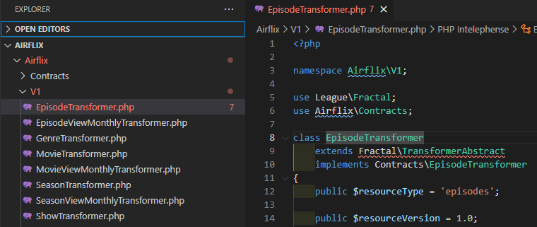

Laravel で APIのバージョン管理をする場合、どんな方法がいいのだろう。  
と思い、オープンソースを参考にしてみる事にした。  

ちなみに、APIのバージョン管理、↓のような感じ。
```
https://qiita.com/api/v2/items

※「v2」がバージョン番号
```

以下、Laravel を使用したオープンソースを適当にピックアップして調査してみました。  

調査対象の基準は、  
『リポジトリ内を「v1」「v2」というキーワードで検索して、何かしらのファイルがヒットしたか』  


### Koel
[https://github.com/koel/koel](https://github.com/koel/koel)  

一見、バージョン管理してるっぽく見えたけど、管理しているのは old ファイルのみ？  
特にプロダクトとして組み込んでいるわけでは無さそう。  


### MONICA
[https://github.com/monicahq/monica](https://github.com/monicahq/monica)  

'us1.locationiq.com/v1/' という固定文字があったが、それ以外は特に無し。  
特に参考になる内容は無さそう。  


### Laracom
[https://github.com/jsdecena/laracom](https://github.com/jsdecena/laracom)  

'v1' という記述があったが、単に CDN をコールしているだけだった。  


### October
[https://github.com/octobercms/october](https://github.com/octobercms/october)  

検索に引っかかったのはコメントのみ。  


### AIRFLIX
[https://github.com/wells/airflix](https://github.com/wells/airflix)  

ようやくそれっぽいのが見つかった。  

  

「v1」という階層を設け、そこにファイルを格納していく、という方法。  

バージョンが上がるごとに、無関係なファイル（変更が加えれれなかったファイル）もどんどん増えて行くのか・・・？  
それはちょっと避けたい。  

「$resourceVersion = 1.0」という変数があるが、詳細は未調査。  

バージョンアップの影響が、今後も限定的に留められるアプリならまだしも、バージョンアップの影響範囲が今後も読めないプロダクトで実施すると、後で酷い目に遭いそう。  


## オープンソースを調べての感想
良く考えたら、オープンソースなんて個人または少数の開発者が趣味でやってるのが大半だし、そうなると APIのバージョン管理なんて面倒な事、誰もしたくないよね。  

こんなのが必要なのは、きっかりした会社の正式プロダクトだ。  

という事で、オープンソースはあまり参考にならなさそう。


## その他の参考情報
という事で、他の方法を調べてみた。  

[Laravel で API バージョニングを実装するなら](https://www.slideshare.net/ShoheiOkada/laravel-api-116459164)  

[APIのバージョニングは限局分岐でやるのが良い](https://kenn.hatenablog.com/entry/2014/03/06/105249)  

[Laravel RESTful APIバージョン管理設計](https://www.it-swarm-ja.com/ja/php/laravel-restful-api%E3%83%90%E3%83%BC%E3%82%B8%E3%83%A7%E3%83%B3%E7%AE%A1%E7%90%86%E8%A8%AD%E8%A8%88/1053957727/)  

[LaravelでAPIのバージョニングをする](https://qiita.com/wrbss/items/c7849e5ac998ab9504f1)  

[Versioning your REST API with Laravel](https://medium.com/mestredev/versioning-your-rest-api-with-laravel-646bcc1f70a4)  


結局、泥臭く頭捻りながら考え出すしか無さそう。  


