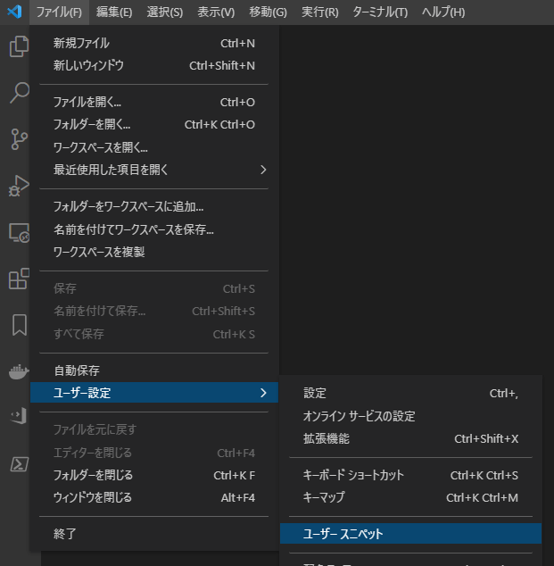
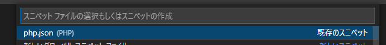
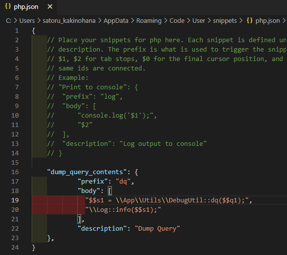
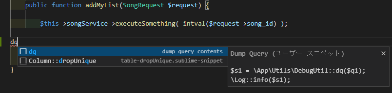
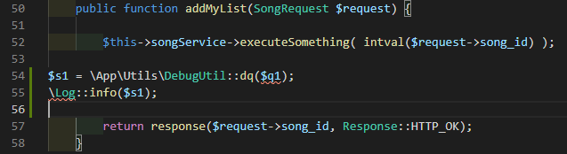

**【 環境 】**  
**Laravel のバージョン： 8.16.1**  
**PHP のバージョン： 7.4.7**  
**MySQL のバージョン： 5.7**  


## 発行された SQL のトレース： toSql() と getBindings() 
Laravel を使って DB から値を取得する時、elquent model を使う事が多いかと思います。  

が、  
「あれ？　何か取ってきた値がおかしい。色々とメソッドをこねくり回してるみたいだけど、実際に発行された SQL って、どんな風になってるの？」  
という事を知りたいと思った時、トレースが結構面倒くさい。  

例えば、こんな感じ。
```php
$query = \App\Models\Authors::where('gender_type', '=', 1);

dd(　$query->toSql()　);
dd(  $query->getBindings() );

//=>
// "select * from `authors` where `gender_type` = ?"
// array:1 [▼
//   0 => 1
// ]
```
まず、発行した SQL文を知るには「toSql()」メソッドが必要となる。  
しかし、このメソッドの戻り値は、動的にセットする内容は「?」 という文字列に置き換えられ、SQLの全文を知るには、「ここ（? の部分）に何の値が入ったか」を知る必要がある。  

「何の値が入ったか」を調べるには、「getBindings()」を使う必要がある。  
ここで「?」に何が入ったかを調べ、この値を適用する事でようやく「どんな SQL文が発行されたか」を知ることができる。  

はっきり言って、超面倒くさい。  

セットする変数が 1個だけなら、まだ何とか我慢できるが、そもそもセットする変数が 1個だけならそんな状況が生まれるはずも無いし、実際のプロダクトコードはもっと複雑だ。  


## enableQueryLog と getQueryLog
enableQueryLog と getQueryLog を使う方法もあるが、ちょっと使いづらい。  

具体的には、こんな感じ。
```php
\DB::enableQueryLog();

$user = \App\Models\User::where('id', 1)->get();
$latestPostRecords = Post::latest()->take(5)->get();

dd(\DB::getQueryLog());
```
SQL実行前に DB::enableQueryLog() でクエリログを有効化し、  
SQL実行後に DB::getQueryLog() メソッドを利用する。  

また、「get()」等の、値を取得するメソッドが必要のようで、処理の途中に挟む、といった使い方がやりづらい。


## RDB の機能を使う
例えば MySQL なら、発行された 全SQLのログを取る事ができる。  

https://dev.mysql.com/doc/refman/8.0/ja/query-log.html
```
set global general_log = on;
```
こういう設定。  

発行された内容は MySQL のログを見なけれ行けなかったり、設定の ON/OFF の切り替えが面倒だったり、そもそもその程度でミドルウェアの設定なんざ触りたくねーよ  
と、実行には色々とハードルが高い。


## ユーティリティを作る
という訳で、ユーティリティにしてみよう。  
リポジトリはこんな感じ。  
https://github.com/kakisoft/PracticeLaravel8-01/blob/main/my-laravel-app/app/Utils/DebugUtil.php  

toSql() だと、こんな感じ。（SQLに ? が入る）
```php
$query = $this->model->where('gender_type', '=', 1);
\Log::info($query->toSql());
//=> select * from `authors` where `gender_type` = ?
```

今回作ったユーティリティだとこんな感じになります。（SQL に値が入る）
```php
$query = $this->model->where('gender_type', '=', 1);
$paramFilledSql = \App\Utils\DebugUtil::getEloquentSqlWithBindings($query);
\Log::info($paramFilledSql);
//=> select * from `authors` where `gender_type` = 1
```


階層は、こんな感じ。
```
└─app
   └─Utils
      └─DebugUtil.php 
```


・・・実はソースコードは以下のページからの、ほぼパクリですが。  
[How can I get the raw query string from Laravel's query builder BEFORE executing the query?](https://stackoverflow.com/questions/20045732/how-can-i-get-the-raw-query-string-from-laravels-query-builder-before-executing)  


書いたコードは、こんな感じ。
```php
<?php

namespace App\Utils;

class DebugUtil
{
    /**
     * 【 概要 】
     * PHP の where メソッド等で設定したパラメータをセットした SQL文を返す
     *
     * 呼び出し方法：
     *     \App\Utils\DebugUtil::getEloquentSqlWithBindings($query);
     *
     * 使い方の例：
     *     -----【 PHP コード 】--------------------------------------------------------
     *     $query = $this->model->where('gender_type', '=', 1);
     *     $paramFilledSql = \App\Utils\DebugUtil::getEloquentSqlWithBindings($query);
     *     \Log::info($paramFilledSql);
     *
     *     -----【 戻り値 】-------------------------------------------------------------
     *     select * from `authors` where `gender_type` = 1
     *
     *     ※「`gender_type` = ?」でなく、PHPコードの where メソッドで指定した値がセットされた SQL が出力される
     *     -----------------------------------------------------------------------------
     */
    public static function getEloquentSqlWithBindings($query)
    {
        return vsprintf(str_replace('?', '%s', $query->toSql()), collect($query->getBindings())->map(function ($binding) {
            $binding = addslashes($binding);
            return is_numeric($binding) ? $binding : "'{$binding}'";
        })->toArray());
    }

    /**
     * Dump Query
     *
     * getEloquentSqlWithBindings の名前が長かったので、エイリアスとして設定。
     */
    public static function dq($query)
    {
        return self::getEloquentSqlWithBindings($query);
    }
}
```


## コードスニペットとして登録

スニペット（部品として簡単に呼び出せるコード）として、少ないタイプ入力で呼び出せるようにしてみよう。  

### １．
　　ファイル -> ユーザ設定 -> ユーザスニペット  

を選択。  

  

### ２．
「 php.json 」と入力し、選択。  

  


### ３．
php.json を編集。  

  


今回、こんな感じで追加しました。  
```json
    "dump_query_contents": {
	        "prefix": "dq",
	        "body": [
			  "$$s1 = \\App\\Utils\\DebugUtil::dq($$q1);",
			  "\\Log::info($$s1);"
	        ],
	        "description": "Dump Query"
	},
```
今回、「 dq 」という入力で呼び出せるようにしています。  

「 $ 」を表現する場合、「 $$ 」  
「 \ 」を表現する場合、 「 \\ 」  
と記述します。  

### ４．
エディターにて、「 dq 」という文字を入力すると、候補として php.json に設定した内容が出てくるようになります。

  


### ５．
上記の状態で「tab」を押すと、登録していたコードを呼び出す事ができます。  

  


