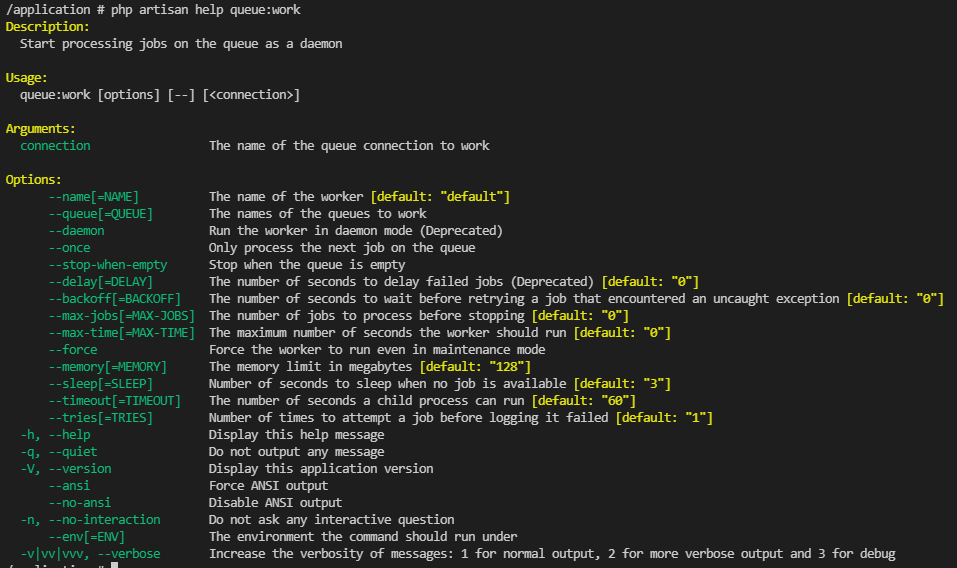

**【 環境 】**  
**Laravel のバージョン： 8.16.1**  
**PHP のバージョン： 7.4.7**  


## queue:work のオプション
Laravel の queue:work（キューワーカーを起動するオプション）を見ていると、「sqs」や「redis」といった記述を見かけることがある。  


### Laravel 公式サイト
https://laravel.com/docs/8.x/queues
```
php artisan queue:work sqs --sleep=3 --tries=3 --max-time=3600
```

### DEV Communith : Configuring Laravel Queues with AWS SQS
https://dev.to/ichtrojan/configuring-laravel-queues-with-aws-sqs-3f0n  

コマンドの例として出てきてはいるものの、詳細説明なし。  
（Laravel では珍しい事ではないので、そこは特に気にしていない。）
```
php artisan queue:work sqs
```

え？　こんなの指定できるオプションあったっけか。  
と思い、ヘルプコマンドにて表示。  

ヘルプコマンドは以下です。
```
php artisan help queue:work
```

  

うん。**どこにも書いてないぞ、そんなオプション。**  


## Laravel のソースから調べてみる
という事で、Laravel のソースを読んでみよう。  

マニュアル読んでも分からない事があったら、ソースコード直接読んで調べる事ができるのはオープンソースのいい所だね。  

### framework\src\Illuminate\Queue\Console\WorkCommand.php
https://github.com/laravel/framework/blob/8.x/src/Illuminate/Queue/Console/WorkCommand.php#L81
```php
    /**
     * Execute the console command.
     *
     * @return int|null
     */
    public function handle()
    {

//（中略）

        $connection = $this->argument('connection')
                        ?: $this->laravel['config']['queue.default'];
```
### framework\src\Illuminate\Queue\Console\WorkCommand.php
https://github.com/laravel/framework/blob/8.x/src/Illuminate/Queue/Console/WorkCommand.php#L15
```php
class WorkCommand extends Command
{
    /**
     * The console command name.
     *
     * @var string
     */
    protected $signature = 'queue:work
                            {connection? : The name of the queue connection to work}
                            {--name=default : The name of the worker}
                            {--queue= : The names of the queues to work}

```

正体は「connection?」という省略可能引数で、説明は「The name of the queue connection to work（動作するキュー接続の名前）」という事が分かりました。  

省略した場合は『```$this->laravel['config']['queue.default']```』が適用されるみたい。  

具体的には、ここ。（各自の Laravel プロジェクト）  
### config\queue.php
```php
return [

//（中略）

    'default' => env('QUEUE_CONNECTION', 'sync'),
```
env の設定を優先。  
設定していない場合、sync。  

.env は、こんな感じになってたりすると思います。  
### .env
```
BROADCAST_DRIVER=log
CACHE_DRIVER=database
QUEUE_CONNECTION=database
SESSION_DRIVER=file
SESSION_LIFETIME=120
```

## 結論

*** queue:work の connection オプションを指定しなかった場合、.env のQUEUE_CONNECTION の設定を使用する***  


__________________________________________________________________________________________________________
## おまけ
ヘルプの文字起こし
```
# php artisan help queue:work
Description:
  Start processing jobs on the queue as a daemon

Usage:
  queue:work [options] [--] [<connection>]

Arguments:
  connection                 The name of the queue connection to work

Options:
      --name[=NAME]          The name of the worker [default: "default"]
      --queue[=QUEUE]        The names of the queues to work
      --daemon               Run the worker in daemon mode (Deprecated)
      --once                 Only process the next job on the queue
      --stop-when-empty      Stop when the queue is empty
      --delay[=DELAY]        The number of seconds to delay failed jobs (Deprecated) [default: "0"]
      --backoff[=BACKOFF]    The number of seconds to wait before retrying a job that encountered an uncaught exception [default: "0"]
      --max-jobs[=MAX-JOBS]  The number of jobs to process before stopping [default: "0"]
      --max-time[=MAX-TIME]  The maximum number of seconds the worker should run [default: "0"]
      --force                Force the worker to run even in maintenance mode
      --memory[=MEMORY]      The memory limit in megabytes [default: "128"]
      --sleep[=SLEEP]        Number of seconds to sleep when no job is available [default: "3"]
      --rest[=REST]          Number of seconds to rest between jobs [default: "0"]
      --timeout[=TIMEOUT]    The number of seconds a child process can run [default: "60"]
      --tries[=TRIES]        Number of times to attempt a job before logging it failed [default: "1"]
  -h, --help                 Display help for the given command. When no command is given display help for the list command
  -q, --quiet                Do not output any message
  -V, --version              Display this application version
      --ansi|--no-ansi       Force (or disable --no-ansi) ANSI output
  -n, --no-interaction       Do not ask any interactive question
      --env[=ENV]            The environment the command should run under
  -v|vv|vvv, --verbose       Increase the verbosity of messages: 1 for normal output, 2 for more verbose output and 3 for debug
```
