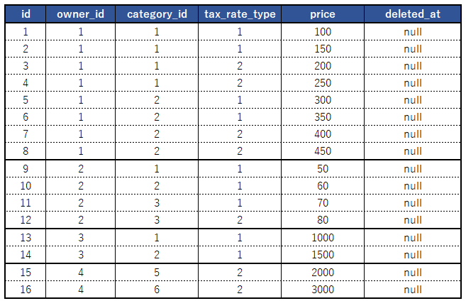
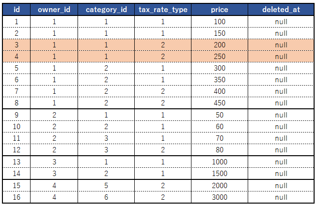
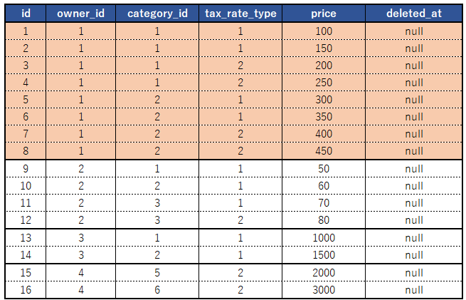
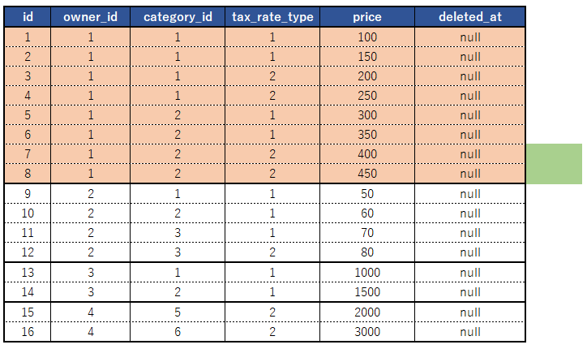
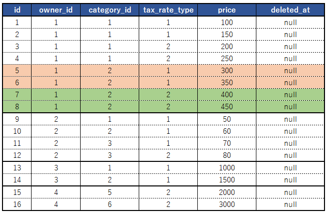

**【 環境 】**  
**Laravel のバージョン： 8.16.1**  
**PHP のバージョン： 7.4.7**  
**MySQL のバージョン： 5.7**  

以前、こんなのを書きました。  

[【MySQL・Laravel】意図されないインデックスが使用され、update時にロックがかかってしまった時の対応](https://kaki-note-02.netlify.app/2021/12/19/)  

インデックスを使用している時、update発行時にデッドロックが発生するケースがある、という内容ですが、デッドロック発生までのメカニズムがちょっと分かりづらい気がしたので、図解してみようかと思います。 


## １．レコード例
こういうレコードがあったとします。  
テーブル名は「items」です。  

  

インデックスは以下とします。

インデックス１（items_index_1）：owner_id, deleted_at  
インデックス２（items_index_2）：owner_id, category_id, deleted_at  
インデックス３（items_index_3）：owner_id, category_id, tax_rate_type, deleted_at  


## ２．
以下のような update 文が発行されたとします。  

```sql
update  items
   set  price = 100
where  1=1
  and  owner_id      = 1
  and  category_id   = 2
  and  tax_rate_type = 1
  and  deleted_at is null
```

owner_id, category_id, tax_rate_type, deleted_at を指定しているので、効いてほしいインデックスは、「インデックス３」となります。  

以下の図の範囲です。  

  

この時、インデックスが適用された範囲は、ロック対象となります。

## ３．
意図通りにインデックスが適用されず、「インデックス１（owner_id, deleted_at）」が適用される事があります。  

この場合、ロックされる範囲は、以下の図の通りとなります。（）

  

SQLにて、「owner_id = 1」という条件が指定されています。  
この範囲がロックの対象です。  


## ４．
この時、以下のような SQL が発行されとします。  
（「tax_rate_type = 2」の部分のみが相違点です。）  

```sql
update  items
   set  price = 100
where  1=1
  and  owner_id      = 1
  and  category_id   = 2
  and  tax_rate_type = 2
  and  deleted_at is null
```

  

この update 文にて更新対象となるのは緑の部分のみですが、インデックスによりオレンジの範囲がロック対象となっているため、ロックがかかってしまいます。  
１つだけならウェイトをかけてくれるのですが、ウェイトが２つ以上あった場合、MySQL はデッドロックエラーとして処理します。  

## ５．
解決策として、インデックスを明示して、ロックがかかる範囲が狭くなるようにします。  
具体的には、「force INDEX」句を使用します。  

### SQL 1
```sql
update  items force INDEX (items_index_3)
   set  price = 100
where  1=1
  and  owner_id      = 1
  and  category_id   = 2
  and  tax_rate_type = 1
  and  deleted_at is null
```

### SQL 2
```sql
update  items force INDEX (items_index_3)
   set  price = 100
where  1=1
  and  owner_id      = 1
  and  category_id   = 2
  and  tax_rate_type = 2
  and  deleted_at is null
```

オレンジに部分が、「SQL 1」にてロックされる範囲、  
緑の部分が「SQL 2」にてロックされる範囲です。  

  

## あとがき
通常の処理であればここまで気を回さずとも問題ないケースが多いのですが、複数のバッチが並列で動く場合、結構頻繁に起こります。  

これで完全に回避できるというワケでは無いですが、それでも劇的に減らす事はできたので、何かしらのお役に立てればと思います。  


