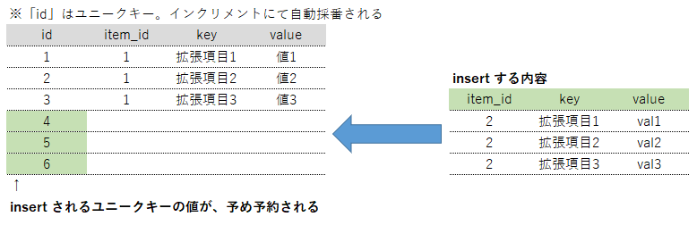
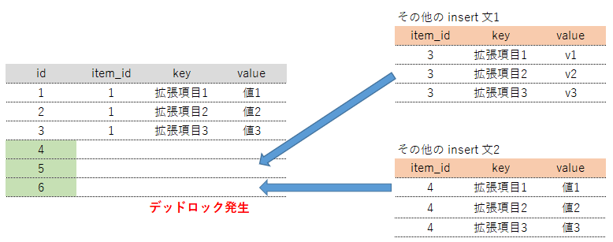
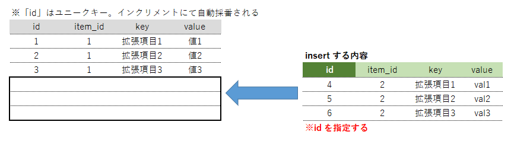
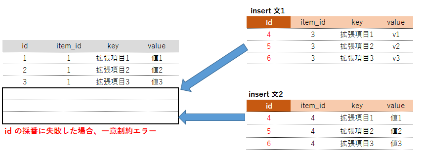

**【 環境 】**  
**Laravel のバージョン： 8.16.1**  
**PHP のバージョン： 7.4.7**  
**MySQL のバージョン： 5.7**  


## MySQL：insert 時に発生するデッドロック
MySQL にて、update 時にデッドロックが発生する事があります。  
詳細は以下を。  

[【MySQL・Laravel】意図されないインデックスが使用され、update時にロックがかかってしまった時の対応](https://kaki-note-02.netlify.app/2021/12/19/)  

update のみならず、insert 時もデッドロックが発生する事があります。  

原理としては、以下のような感じです。  

#### １．
プライマリキーは id で、AUTO_INCREMENT としています。  
この場合、insert 時、ユニークキーとなる値があらかじめ予約されます。  

  

#### ２．
ユニークキーが予約された状態で、その他の insert 文が２つ以上発行されると、デッドロックが発生する。  

  


#### ＜参考（MySQL公式サイト）＞  
[14.6.5.2 構成可能な InnoDB の自動インクリメントロック](https://dev.mysql.com/doc/refman/5.6/ja/innodb-auto-increment-configurable.html)  

> InnoDB では AUTO_INCREMENT カラムを含むテーブルへの挿入を行う際に、AUTO-INC ロックと呼ばれる特殊なテーブルレベルロックが使用されます。  
>  
> このロックは通常、指定された一連の INSERT ステートメントに予測可能かつ繰り返し可能な順序で自動インクリメント番号が割り当てられるように、(トランザクションが終了するまでではなく) ステートメントが終了するまで保持されます。

## 対応方法

**参考記事.１**  
[MySQLでINSERTのデッドロックに嵌る人を1人でも減らすために](https://ichirin2501.hatenablog.com/entry/2015/12/24/164916)  

 * BULK INSERTはソートしよう
 * 避けられないケースは存在するので基本はエラー前提で設計しよう
 * INSERTで内部リトライ処理を書くときはトランザクションの粒度に気をつけよう


**参考記事.２（公式サイト）**  
[How to Minimize and Handle Deadlocks](https://dev.mysql.com/doc/refman/5.7/en/innodb-deadlocks-handling.html)  

 * **デッドロックは起こるもの。** デッドロックが発生した場合、もう一度やり直す。
 * デッドロックの発生となる原因は収集しておこう
 * トランザクションを小さく、処理の時間を短くする
 * 関連する一連の変更を行った直後にトランザクションをコミットする

他にもいっぱいあるけど、詳細はリンク先を参照ください。  

### 要約
デッドロックの完全回避は不可。  
頑張って向き合ってね。  

特に、並列でジョブが流れる場合、デッドロックは避けられないみたい。  
ただ、工夫次第では減らす事ができる。  
実際、現在のプロジェクトでは、update 時に発生するデッドロックは、インデックスを指定する事で防げています。  

[【MySQL・Laravel】意図されないインデックスが使用され、update時にロックがかかってしまった時の対応](https://kaki-note-02.netlify.app/2021/12/19/)  

が、insert の場合は違った対策が必要となりそうです。  

## 回避策１．insert 時、プライマリキーを指定する
insert 時、プライマリキーをオートインクリメントの機能に任せず、登録側で指定するようにする。  

  

が、複数のトランザクションが走る場合は一意制約違反が発生し、それを防止する仕組みが必要となる。  

  

局所的な状況でしか使えなさそう。  


## 回避策２．プライマリキーを UUID または ULID にする
insert 時に予約しているプライマリキーがバッティングするのがデッドロックの原因なら、そもそもバッティングする可能性が無い値を使えばよいのでは？  
という考え。  

### UUID (Universally Unique Identifier)
<https://dev.mysql.com/doc/refman/5.6/ja/miscellaneous-functions.html#function_uuid>  

ユニバーサル固有識別子 (UUID)。  
小文字の16進数表記桁の並びをいくつかのグループでハイフンで区切って表現したもの。  

↓こんな感じの文字列  
```
550e8400-e29b-41d4-a716-446655440000
```

ただ、プライマリキーに UUID を使う場合、パフォーマンスの面で問題が出る事があるらしい。  

[MySQLでプライマリキーをUUIDにする前に知っておいて欲しいこと](https://techblog.raccoon.ne.jp/archives/1627262796.html)  

> レコードが増えるとランダム値のパフォーマンスが劣化して最終的には10~20倍以上の差となることが多いようです。  
>   
> その一方で UUID を利用すれば複数セッションからの更新が1つのリーフページに集中することなく分散できるのでラッチ競合が起きずにパフォーマンスが良いという趣旨の記事も稀に見かけます。

何だかカオス。  
「UUIDに変えると遅くなるという報告が多いみたいだけど、そうでないケースもある」という感じだろうか。  

プライマリキーを変えるというのは、結構コストの高い修正になるケースも多いので、気軽に実験しづらいのがネック。  

今回のプロジェクトの場合、パフォーマンスを犠牲にする事は避けたかったので、見送り。  

### ULID (Universally Unique Lexicographically Sortable Identifier)
<https://github.com/ulid/spec>  

「MySQLでプライマリキーをUUIDにする前に知っておいて欲しいこと」のサイトでも、解決策の１つとして提示されている。  

> ミリ秒単位の経過時間を元に生成されるので、完全なシーケンシャルとは言いがたいですが UUID のパフォーマンス課題を解決する手段としてはこれくらいで十分です。

ただ、MySQL は、UUID を型としてサポートしているが、ULID はサポートしていない。  
なので、string 等を使う必要がある。  

ちなみに、Laravel で UUID を使う場合、こんなライブラリがあったりする。  

<https://github.com/rorecek/laravel-ulid>  

create メソッドを使って insert 文を発行する時、自動で ULID を適用してくれるみたい。  

が、バルクインサート時にはユーティリティをコールする必要がある。  
イメージとしては、こんな感じ。  

```php
    $insertData = [];
    foreach ($records as $record) {
        $insertData[] = [
            'id' =>  \Ulid::generate(),
            'key' => $record['key'],
            'value' => $record['value'],
        ];
    }
    $this->model->insert($insertData);
```

今回のように、「insert時にデッドロックが発生する問題を何とかしたい」というケースの場合、composer install でプロジェクトを組み込まずとも、部分的にコピーして、ULID の生成部分をユーティリティとして使う、という選択肢もアリな気がする。  

参考ソースは、こんな感じ。  
<https://github.com/rorecek/laravel-ulid/blob/master/src/HasUlid.php>  

スキーマ変更のコストが低ければ、この方法は有効だと思う。

## 回避策３．オートインクリメントのモード（innodb\_autoinc\_lock\_mode）を変更する
＜参考＞  
[MySQLのAUTO_INCREMENTについて](https://gihyo.jp/dev/serial/01/mysql-road-construction-news/0049)  
[構成可能な InnoDB の自動インクリメントロック](https://dev.mysql.com/doc/refman/5.6/ja/innodb-auto-increment-configurable.html)  

オートインクリメントを実行するにあたり、いくつかのモードがあるらしい。  

確認方法は以下。  
```sql
SELECT @@innodb_autoinc_lock_mode
```
こんな感じで表示されます。  

|  @@innodb\_autoinc\_lock\_mode  |
|:-----------------------------|
|  1                           |

my.conf にて定義されるケースもあるみたいです。
```
[mysqld]
innodb_autoinc_lock_mode=1
```

### 値の詳細

|  値    |  モード             |
|:------|:-----------------|
|  0    |  従来ロックモード        |
|  1    |  連続ロックモード        |
|  2    |  インターリーブ ロックモード  |

MySQL 5 だとデフォルト値は「1」、  
MySQL 8 からはデフォルト値は「2」となる。  

#### 0 ：従来ロックモード
下位互換のために残されている。通常は使用しない。  

#### 1：連続 ロックモード
挿入される行が事前に行数の把握できない INSERT..SELECT 文や LOAD DATA INFILE 文などの挿入文（一括挿入）時に対して AUTO_INC ロックを取得する。  

事前に行数の把握できる単純挿入は，これとは別の軽微な排他ロックを取得するため同時挿入性能は上がる。  
一括挿入の AUTO_INCREMENT の順番が守られるので、ステートメントベースレプリケーションでも正常にレプリケーションされる。  

※レプリケーション・・・データの複製（レプリカ）を別のサーバに持つ機能。マスター・スレーブ構成など。

#### 2：インターリーブ ロックモード
すべての挿入する文に対して AUTO\_INC ロックを取得しない。  
長時間に渡る一括挿入の実行間でも並列挿入ができるため，高速で処理される。  
ただし、一括挿入の AUTO\_INCREMENT の順番が守られないので、行ベースでのみレプリケーション可能となる。  

※インターリーブ・・・計算機科学と電気通信において、データを何らかの領域（空間、時間、周波数など）で不連続な形で配置し、性能を向上させる技法。

### 適用について
「2：インターリーブ ロックモード」の場合、ロックをかけないので、デッドロックが発生しない。  
欠点としては、id の順番が担保されない。そのため、レプリケーション時に注意が必要となる。  

そもそも、insert 時にレプリケーションを考慮するようなシステムって、かなり限定されるのではないだろうか。  
データはマスターテーブルに書き込むだろうし、よっぽど超巨大かつ特殊なシステムでない限りマスターテーブルは１つしか存在しないだろうし。  

という事で、こっちを採用する方が現実的なケースが多くなりそうです。  
欠点も、別に目を瞑って問題なさそうな内容だし。  

MySQL 8 では「2：インターリーブ ロックモード」がデフォルト設定になるという点でも、安心感の担保になります。  


## オートインクリメントのモード（innodb\_autoinc\_lock\_mode）を変更する方法
どうやら、コマンドでサクッと変更する方法は無いみたい。  
いくら探しても見つける事が出来ませんでした。  

見つけたのは、mysql.cnf にて設定する事ぐらい。  
##### mysql.cnf
```
[mysqld]
innodb_autoinc_lock_mode=2
```

え？マジで？と思ったが、MySQL Forums でもこんな感じだし。  
<https://forums.mysql.com/read.php?22,695815,695815>  

公式サイトを見ると、「--innodb-autoinc-lock-mode=#」みたいなコマンドで出来るように見える。  
<https://dev.mysql.com/doc/refman/8.0/en/innodb-parameters.html#sysvar_innodb_autoinc_lock_mode>  

以下、抜粋した内容。

 * innodb\_autoinc\_lock\_mode

|          -             |              -                 |
|:-----------------------|:-------------------------------|
|  Command-Line Format   |  --innodb-autoinc-lock-mode=#  |
|  System Variable       |  innodb\_autoinc\_lock\_mode      |
|  Scope                 |  Global                        |
|  Dynamic               |  No                            |
|  SET_VAR Hint Applies  |  No                            |
|  Type                  |  Integer                       |
|  Default Value         |  2                             |
|  Valid Values          |  0, 1, 2                       |


試しにコマンドを入力してみる。  
```
mysql> SET GLOBAL innodb_autoinc_lock_mode = 2;
ERROR 1238 (HY000): Variable 'innodb_autoinc_lock_mode' is a read only variable
```
「 "innodb\_autoinc\_lock\_mode" は読み取り専用です。」という無情なメッセージが。  

一応、「 SET innodb\_autoinc\_lock\_mode = 2; 」でも試してみましたが、結果は同じでした。  

『 Command-Line Format ： --innodb-autoinc-lock-mode=# 』というのはいったい何者？  
こいつを使う事ができれば、innodb\_autoinc\_lock\_mode の値を変える事ができるのでは？  
と疑問に思い、コマンドをこねくり回すも、シンタックスエラーの無情なメッセージが出るのみ。  

調べてみると、こんなのが見つかった。  

[AUTO_INCREMENT Handling in InnoDB](http://doc.docs.sk/mysql-refman-5.5/innodb-auto-increment-handling.html)  

> In MySQL 5.5, there is a configuration parameter that controls how InnoDB uses locking when generating values for AUTO_INCREMENT columns.   
>  
> This parameter can be set using the --innodb-autoinc-lock-mode option at mysqld startup.

どうやら、「 --innodb-autoinc-lock-mode 」を使ったパラメータの指定は、MySQL のデーモンを起動する時にしか指定できないみたい。  

という事で、innodb\_autoinc\_lock\_mode の値を変更するには、事実上 mysql.cnf を編集するしか方法が無いという事になりました。  


AWS(RDS)を使う場合、パラメータグループにて、「 innodb\_autoinc\_lock\_mode 」というパラメータがあるので、それを「 2 」に変更できます。  

## その他参考情報
[MySQL InnoDBにおけるPKにUUIDを使ったINSERTのパフォーマンスの調査](https://spring-mt.hatenablog.com/entry/2021/03/03/033320)  
[MySQL InnoDB Primary Key Choice: GUID/UUID vs Integer Insert Performance](https://kccoder.com/mysql/uuid-vs-int-insert-performance/)  


