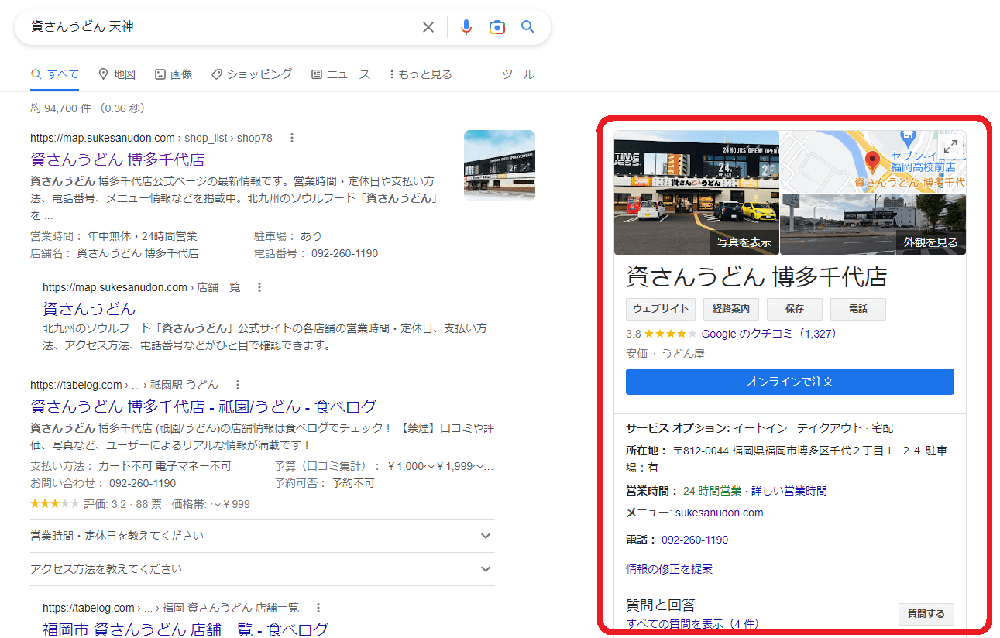
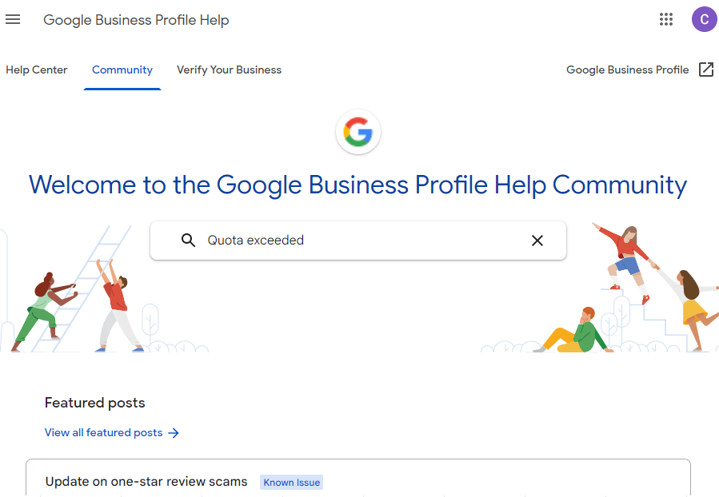
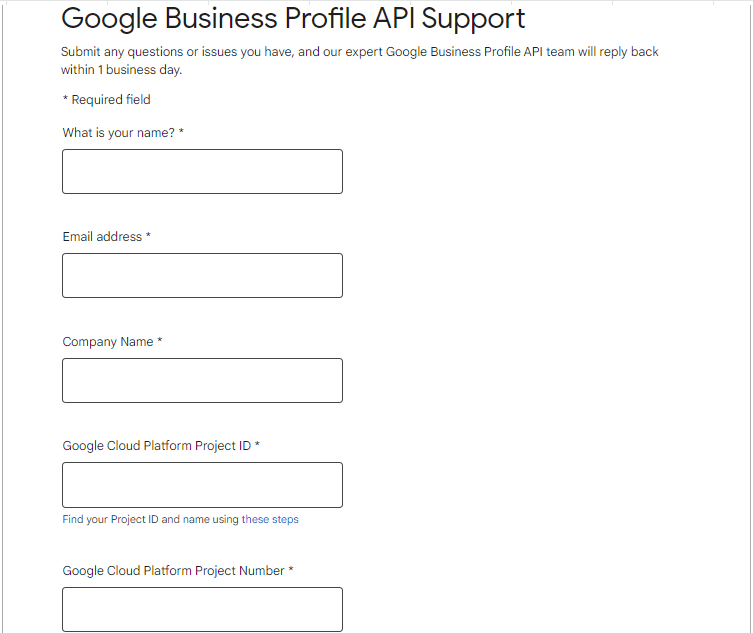
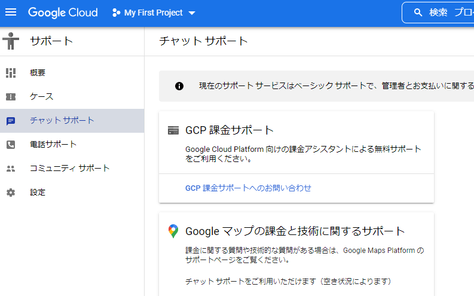
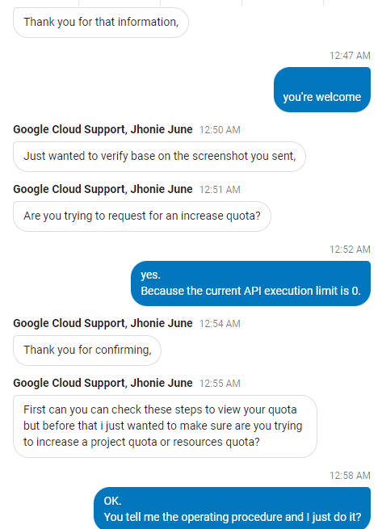
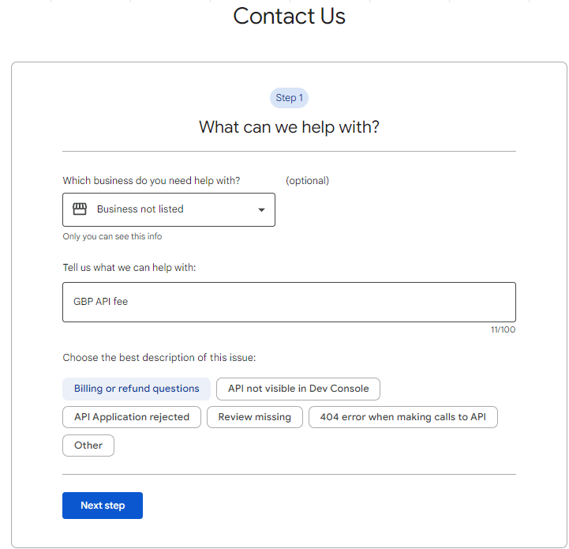
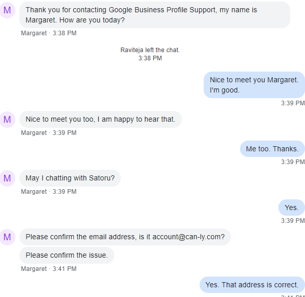
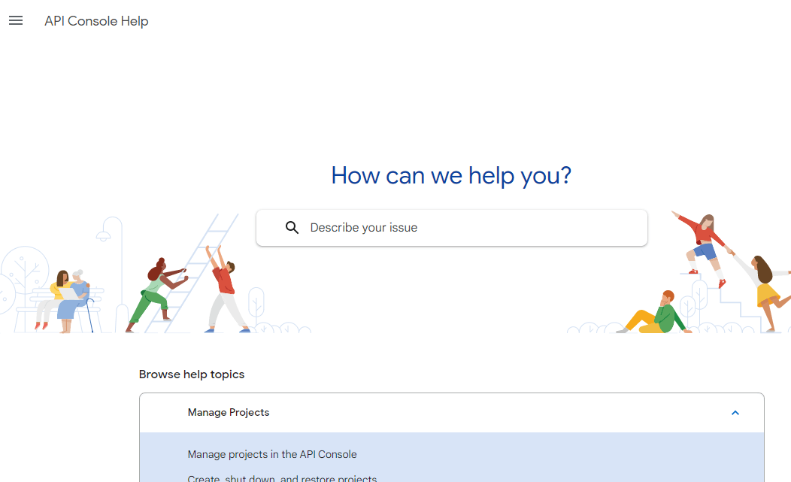

GBP（Google Business Profile）というものをご存じでしょうか。  

簡単に説明すれば、Google 検索した時に出てくる、お店のダイジェスト情報です。  

  

実際にお店のWebサイトに訪れなくとも情報を知る事ができます。  
この情報をきっかけに訪れるお客さんも多く、上手く活用すれば集客やマーケティングに活用できるのが特徴です。  

これらのデータを取得するための APIがあるのですが、一部のAPIが廃止となり、完全に新しいAPIへのリプレイスが必要な部分が出てきました。  

これまでは無料で使えていたのですが、新しい APIは有料アカウントへ移行が必要だったり、アカウントのアップグレードが必要だったりと、どうも有料化となってしまう方向性が垣間見えてしまったので、具体的にいくらぐらいかかるのかを調べてみたところ、Google サポートセンターの凄まじい迷宮に翻弄されました。  

以下、その経緯です。  

## 1. Google ビジネス プロフィール コミュニティ 
<https://support.google.com/business/community>

  

移行期間中のため、新しいAPI の情報がまだ少なく、特に有益な情報を得る事は出来ませんでした。  

## 2. Google Business Profile API Support
<https://support.google.com/business/contact/api_default?hl=en>

  

お問合せフォームからの問い合わせ。  
2022年12月現在、日本語の対応はしていないので、英語で問い合わせる事になります。  

頑張って書いたものの、「Google Cloud のサポセンに聞いてね」と、何とも頼りない返信が返ってきました。  

## 3. Google Cloud チャットサポート

  

チャットによるサポートを受ける事ができます。  
日本語は対応していないので、英語での問い合わせとなります。  

こんな感じで、サポート担当者とリアルタイムでチャットしながらの問い合わせができます。  

  

ただ、技術の専門家と話しているというより、コールセンターの窓口と話しているような感覚で、的を射た回答はほとんど得られませんでした。  
質問した内容についても、「それはウチの管轄じゃないね」「他所の窓口に聞いて」といった内容がメインです。  

そんな中、聞き出した情報は以下のような内容でした。  

* GBPは別サービスだから、ちょっと分からないね。
* 最初は無料アカウントで使ってみて。300$の無料枠があるから、いきなり請求される事は無いよ
* GBP ヘルプセンターに聞いてみて

ちなみに GBPヘルプページは既に問い合わせ済み。  

## 4. GBP ヘルプページ
<https://support.google.com/business/gethelp>

  

メールによる問い合わせと、チャットによる問い合わせが選択できます。

前回、長時間の英語チャットが疲れたので、メールにしました。

返信は「Google Cloudサポートに問い合わせてね」という内容でした。  
（「6. Google Cloudサポート」に続く）  

さすがにその回答はあんまりだろ。と思い、チャットでも問い合わせてみました。

  

こんな感じで、リアルタイムにやり取りをする事が出来ます。

サポート担当者も良く分からないとのことで、「問い合わせ内容は、チケットナンバー "8-XXXYYYZZZ" で登録しておくね。更新情報は、API Console Help を見てね。」
と、また別のページを案内されました。

API Console Help を見ても、チケット番号で検索できる仕組みが見当たらなかったので、どうやってトレースしていけばいいのか聞いてみたところ、サポート担当者もよく分かってないみたいで、どうにも歯切れの悪い回答ばかりが返ってきました。

要約すると、こんな感じ。

 * いや、ウチら知らんし。
 * チケットナンバー？　無視してよ、その番号。
 * まだ聞きたい事あるなら、別の窓口に問い合わせてね。

サポセン、やる気ねえええー－－と思わず脱力した瞬間だった。

## 5. API Console Help
<https://support.google.com/googleapi>

  

知りたかった情報を見つける事が出来ませんでした。

肝心のチケットナンバーについても、謎のままです。

## 6. Google Cloudサポート
<https://cloud. google.com/support-hub>

  

いくつか説明はあるものの、肝心のGBP（Google Business Profile）についての記述は見つからず。  

仕方ないので、個別問い合わせのフォームにて聞いてみる。  

## 7. Google Cloud お問い合わせ
<https://cloud.google.com/contact/>

  

日本語で問い合わせが可能です。  
送信すると、２日後くらいに電話がかかってきました。  

電話内容はこんな感じでした。  

私「（問い合わせしたい内容を説明）」  
　　↓  
GCP サポセン「料金については別部署になるので、すぐに返答は難しかも。お問合せ窓口を教えるので、それで。」  
　　↓  
私「いや、すでに "GBPサポセン → GCPサポセン → GBPサポセン（料金窓口） → GCPサポセン（料金窓口） → GBPサポセン" ってたらい回されるよ。」  
　　↓  
GCP サポセン「すみません。色々と組織内で連携が取れてない所があって。後でメールにて連絡します。」  
　　↓  
私「分かりました。ただ、連絡するにしても、『Q&A のサイトのトップページを張り付けるだけ』ってのは勘弁してください。Webチャットした時の対応者がそんな事してて、それに対して突っ込んだら、『GBP のヘルプに問い合わせて』 って返信来たから。リンク張るなら、『料金はこれ』ってページのリンクをお願いします。」  
　　↓  
GCP サポセン「分かりました。」  

その後、  
「ごめん。担当が違うから回答できないや。こっちに聞いてみて」  
とサポートページを紹介されたのは、「3. Google Cloud チャットサポート」のページでした。  

これ以上は調査してくれなさそうなので、別の方法で調査。  

## 7. API Billing Support
<https://support.google.com/googleapi/contact/api_billing_support>

  

日本語は対応していないので、英語で問い合わせ。  

２日後ぐらいに、ようやく求めていた回答を得る事ができました。  

## 所管
「料金について知りたい」という、めちゃくちゃ分かりやすい場所に書いてくれてよさそうな情報を知りたかっただけなのに、何でこんなにたらい回しにされなければいけなかったのかは謎です。  

組織として連携が取れているとは言い難く、ある部署は「ウチの管轄じゃないね。あっちに聞いて」と回し、別の部署も「ウチの管轄じゃないね。向こうに聞いて」という感じだったので、恐らく『この情報についての問い合わせは、XXの窓口に案内する』という情報は、中の人にも良く分かってないのではないかと思われます。  

テクニカルな質問についてもその傾向が見られたので、サポセンに問い合わせるよりも、トライアンドエラーを繰り返しながら泥臭く突き進んで行くのが最適解なんじゃないかと思います。  
（2022年12時点）  

______________________________
# GBP：技術問い合わせ窓口一覧

料金についての問い合わせではなく、技術的な質問をする時の窓口一覧は以下となります。  

例の如く、たらい回しにされる事が予想されるので、一気に全部に問い合わせて返信を待つのがベターではないかと思われます。

## API Console Help
<https://support.google.com/googleapi>

## GBP 問い合わせページ
<https://support.google.com/business/gethelp>

## Google Business Profile APIs  |  Google Developers
<https://developers.google.com/my-business/content/support>

## Google Business Profile API Support - Google Business Profile Help
<https://support.google.com/business/contact/api_default?hl=en>

## Google Business Profile API Support
<https://support.google.com/business/community?hl=ja>

## GCP サポート問い合わせ
<https://cloud.google.com/contact>

